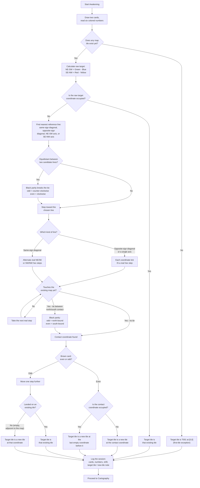

# Suolenkainen's Map — Rules and Practices

v0.2

# Concept

## Ideas

For every map tile, there is a web page. It has the history, pictures, lore, etc. on it.

All “unfinished” things are “questions” rather than unfinished stuff. There are ways to answer those questions. For example a card that is unfinished, is a question. The tile itself can answer that question, or a material, or something.

Incompleteness asks, the inspiration answers.

Map on grid paper to describe the tile ID and coordination points.

## Documentation System

Suolenkainen's Map is tracked across several files, each with a distinct job:

* **The rules file** (this document) holds the stable procedure: phases, matrices, and adopted general rules.  
* **A rules-delta file** holds living clarifications, first-session exceptions, and adopted rulings until they're folded into this file.  
* **A tile-data file** holds durable tile facts: a tile index and one detail record per tile. Add new tiles to the index as soon as Awakening creates or targets them.  
* **A keyword-list file** holds the stable keyword index, referenced by ID from tile records rather than repeating full interpretations in every row.  
* **A session-narrative file** holds phase-by-phase session narrative, kept separate from durable tile facts.

Keep unresolved items short and concrete wherever they're recorded.

## Reading Practice

- Treat each keyword or prompt result as a task, not only a mood. It should eventually ask for a physical choice, a note, a restriction, a material, a mark, or a future obligation.  
- If a result points to something that does not exist yet, record the absence instead of inventing false history. The absence can become a wound, omission, debt, or exception.  
- Prefer the smallest concrete action that satisfies the prompt. A reserved scrap, a named blank, a marked edge, or a note in the log is often enough.  
- If a prompt feels symbolic, ask what object, edge, layer, mark, material, or record could carry that symbol.  
- A prompt can be answered later. Attunement often creates pressure; Surface and Inscription often give that pressure a body.  
- When uncertain, write the uncertainty down as a live question. Do not smooth it away.

# Phases

A session contains of 6 phases:

* Awakening opens the session.  
* Cartography changes the map-object.  
* Attunement prepares the conditions.  
* Surface prepares the visual ground.  
* Inscription adds detail and meaning.  
* Chronicle records and closes the work.

Each phase has its own full section below, in order.

# Phase 1 - Awakening

The first thing to establish is where the last session left off — specifically, which tile was the previous target. That tile's coordinates become the reference point for calculating where to go next.

The coordinate system uses two axes: NE-SW and SE-NW. Each axis runs negative through zero to positive, the same as an ordinary number line — that's the arithmetic convention, not a claim about physical left/right on the tile grid. The very first tile placed — T001 — lives at [0, 0], the origin of everything. It looks unintuitive at first glance, but it becomes natural quickly. The key thing is that every tile has a precise, unambiguous address.

Tiles are hexagons. Counting clockwise from the top, the six sides run N, NE, SE, S, SW, NW. The coordinate axes correspond to two of these six directions — NE-SW and SE-NW — so a shift on a single axis is also a single physical direction on the hex grid, not just an abstract number. A shift on both axes at once can take more than one physical step to walk; see "Walking the two different diagonals" below.

Draw two cards and read their six colored number results; each card also shows an illustrated face (front or back) that later phases may read as an omen or mirror. The new target coordinate is calculated directly from the six numbers. The NE-SW value is green minus blue. The SE-NW value is red minus yellow. This can produce a wide range of results — and it can absolutely send the target to the same tile twice in a row, which is fine. What it can also do, over many sessions, is pull the map in one direction while leaving other areas untouched for a long time. That is something worth watching. A solution may be needed eventually. For now, the map goes where the cards send it.

So: a new target coordinate exists. But there may not be a tile there yet.

## Handling the First Tile / Empty Map

Before any map tiles exist, the first target is always T001 at [0, 0]. That tile is created by dividing it into four quadrants stemming from an anchor point on the tile. The anchor point is part of the tile's first physical structure and should remain available for later phases to answer.

The walk-back logic below, and the brown-number decision that follows it, both assume an existing map to walk back toward. Before any map exists, those instructions are suspended — there is nothing to adjust the aim against yet.

More generally: if any rule in this document cannot operate because the map lacks the state it assumes, do not force it or invent the missing state. Record the exception as a rules delta, if it's likely to recur, or as a Chronicle debt, if it's a one-off gap, and let the session continue.

## Finding the Target: Adjusting the Aim

When the calculated coordinate is empty — no tile exists there — the system does not simply create one on the spot. Instead, it walks the target back toward the existing map, one step at a time.

If the raw calculated coordinate is empty but already touches the existing map by adjacency — the case never arose until it was found and settled during S005 — no walking is needed at all: the walk-back's whole purpose is to reach a coordinate touching the map, and an adjacent-but-empty raw target already does. Skip the reference-line/stepping mechanism below entirely and go straight to the Brown-parity decision (new tile at that coordinate, or one further step, exactly as for any other found-contact coordinate). Only take walk-back steps when the raw target does not yet touch the map at all.

When checking whether a raw target already touches the map, check it against *every* currently-occupied coordinate, not just the neighbors that happen to come to mind first. S006's raw target actually touched four existing tiles at once, but only three were checked during that session's own Awakening — the fourth (a real adjacency to T005) wasn't found until a later, unrelated diagram check. Compute all six neighbor coordinates of the raw target and compare each one against the full list of occupied coordinates before concluding how many tiles it touches.

The logic works like this. From the empty coordinate, identify the nearest of three reference lines running through the origin: the diagonal where the absolute values of both coordinates are equal, or either of the two axes where one coordinate is zero. (The diagonal itself is really two different lines with different walking behavior — see "Walking the two different diagonals" below.) If the target is equidistant between two of these lines, the black card number breaks the tie — odd sends the target to the counter-clockwise option, even to the clockwise one.

From there, move one step toward that reference line. Check the new position: does it touch the existing map, either by landing on a tile or by being adjacent to one? If not, move again. Keep moving until the target lands somewhere that touches the existing map.

To make it concrete: a target at [-4, 5] would first identify the diagonal as its nearest reference line. It steps to [-4, 4], then along the diagonal toward [-3, 3], [-2, 2], [-1, 1]. At [-1, 1], the target is adjacent to an existing tile. Stop.

Now the brown card number makes the final call. If it is even, a new tile is created at that location and the session continues from there. If it is odd, the target moves one step further — which might land on an existing tile, or might move to another empty space that is still adjacent to the map. Either way, the brown number is what decides whether something new is born or whether the session revisits somewhere that already exists.

If the brown number is even but the walk-back path reaches an already occupied coordinate, do not stack a new tile on top of the occupied one and do not convert the result into an existing-tile revisit. Brown even means a new tile is required. In that case, use the last empty coordinate in the walk-back path before the occupied coordinate as the final target. Record both the occupied coordinate that stopped the walk and the last empty coordinate where the new tile appears.

### Walking the two different diagonals

The "diagonal where the absolute values of both coordinates are equal" is actually two different lines, and they behave differently during walk-back:

- **Opposite-sign diagonal** (one coordinate positive, one negative, e.g. [-4, 4]): each coordinate-step along it is also a real single hex move — it is either due N ([+1,-1] per step) or due S ([-1,+1] per step). The worked example above ([-4, 5] to [-1, 1]) is on this diagonal, which is why treating each tick as one step was safe there.
- **Same-sign diagonal** (both coordinates positive, or both negative, e.g. [-4, -4]): a tile's six real sides are only N, NE, SE, S, SW, NW — there is no direct E or W step, so [+1,+1] and [-1,-1] are not real single moves. Walking this diagonal back toward the origin actually alternates between two of those six sides: NE and SE (moving toward positive/east) or SW and NW (moving toward negative/west). Check for map contact after every one of those real steps, not after each two-coordinate tick — real contact is often found earlier than the tick-by-tick coordinate math suggests.

On a same-sign diagonal, this can produce a tie: two paths of equal real-step length reach contact, one having taken the N-side leg (NE or NW) one more time than the S-side leg (SE or SW), the other the reverse. When that happens, the black card number breaks the tie the same way it does for reference lines: odd sends it to the north-bound option (the extra step is NE or NW), even sends it to the south-bound option (the extra step is SE or SW).

It is a simple mechanism with surprisingly interesting consequences.

### Awakening at a glance



## Logging the Session

The target is chosen. Whatever the map holds from this point forward is in the hands of the cards. Before moving into the preparation phase, the session log gets its first entry.

At this stage, the log records:

* Session ID (S002, S003, and so on)  
* Previous tile ID and coordinates  
* The two drawn card identities  
* The six card number results  
* The calculated coordinate shift  
* The actual shift after any adjustments  
* The coordinate-to-physical-direction relationship when placement could be confusing  
* The target tile ID, or a note that a new tile is being created

This is the minimum needed to reconstruct any session from scratch. More fields will be added as the phases develop — tile work notes, material choices, non-map activity records. But this is what gets written down at the end of initiation.

## Awakening Ideas

Raise questions from the drawn cards. What is a mystery a card presents? What is a feature that is unclear? What answers the map can provide to the card?

# Phase 2.1 - Cartography (New tile)

*The tile does not fully exist yet, but the map has already decided what kind of thing is trying to appear.*

It is not Surface yet. So you are not painting, drawing, collaging, decorating, priming, or filling the tile.

Instead, Cartography defines the tile’s birth conditions: how it enters the map-system before it receives a physical body.

A new tile is a **claim without body**.

Cartography answers six questions:

* Origin: How does the tile emerge from the void?  
* Tether: How firmly is it bound to the map?  
* Entanglement: What larger thing is already tangled into it?  
* Temper: What inner force or mood does it carry?  
* Office: What job does it perform in the map?  
* Inheritance: What does it bring with it from elsewhere?

For a new tile, Cartography is the phase where the map decides what kind of newborn map-object is appearing: how it emerges, how it is tethered, what it is tangled with, what force it carries, what role it serves, and what it brings from elsewhere.

After that, Attunement creates binding pressures from the newborn map-object state, and Surface later gives it physical body.

|  | Origin | Tether | Entanglement | Temper | Office | Inheritance |
| :---- | :---- | :---- | :---- | :---- | :---- | :---- |
| **1** | Drawn-In | Anchored | Neighbor-Tangled | Quiet | Connector | Edge Inheritance |
| **2** | Void-Born | Loosely Held | Route-Tangled | Dense | Divider | Echo Inheritance |
| **3** | Twist-Born | Reversed | Region-Tangled | Hungry | Harbor | Material Inheritance |
| **4** | Edge-Starved | Drifting | Grid-Tangled | Divided | Gate | Omen Inheritance |
| **5** | Contagious | Tidebound | Shape-Tangled | Bright | Signal | Void Inheritance |
| **6** | **Origin Matrix**. | **Tether Matrix**. | **Entanglement Matrix**. | **Temper Matrix**. | **Office Matrix**. | **Inheritance Matrix**. |

## Origin

Origin is the tile's birth behavior: not what it looks like yet, but how it first enters the map at all — pulled inward, resisting its surroundings, twisted on the way in, starved outside its contact edges, or already carrying something that will spread. It answers where the tile's existence starts from, before Tether decides how firmly that existence holds.

Not every named Origin needs a mechanical effect. Some (like Twist-Born) are meant to stay narrative-only, guiding how later phases read and describe the tile rather than triggering a rule.

### Drawn-In
*"Surrounding tiles are pulled into it."*

**Effect:** If the Drawn-In tile moves from its location, a random tile (Black number decides, calculating from north clockwise.) is pulled to the tile's previous location.

### Void-Born
*"It resists surroundings and behaves separately."*

**Effect:** If the Void-Born tile moves, it is never affected by any other tile. Any rules that would apply are negated.

### Twist-Born
*"Influences are bent, rotated, or thrown into turmoil."*

**Effect:** None — narrative only

### Edge-Starved
*"Contact edges feed it; non-contact edges become barren/strange."*

**Effect:** When tile is worked, edges without connecting tile are left untouched or minimal.

### Contagious
*"It carries a force that may later bleed outward."*

**Effect:** Every time a tile is changed next to this tile, it bleeds something random to that tile.

### The Origin Matrix

The Origin Matrix is what a Green 6 calls instead of one of the five named Origins above. Rather than a single word, it reads Yellow, Brown, and Black together as Force, Threshold, and Scar — a deeper, stranger, or more compound birth than any one named Origin can hold on its own. Matrix-tier results across all six Cartography categories are narrative-only: they add depth to how the tile is described, but do not carry their own mechanical effect.

**Reading a Matrix result:** each row is written to be read left to right as one connected passage, not three separate fragments. Force gives a standalone definition of itself, then opens a sentence that keeps running through Threshold and closes partway into Scar; Scar's second sentence then stands alone as the takeaway. Force is always two sentences, Threshold is always one, Scar is always two.

|  | Yellow — Force | Brown — Threshold | Black — Scar |
| :---- | :---- | :---- | :---- |
| 1 | Pull: The map itself draws the tile in. Neighboring pressures, edges, or routes drive the tile to be born, entering... | Edge: ...through one touching edge or border... | Clean: ...however, the birth leaves little disturbance. The tile settles and behaves normally. |
| 2 | Refusal: The tile appears by resisting or rejecting its surroundings. That refusal drives the tile to be born, entering... | Gap: ...through absence, blankness, missing space, or unclaimed room... | Barren: ...however, the birth leaves it barren. Some parts remain empty, sterile, pale, silent, or void-touched. |
| 3 | Turbulence: Spin, twist, storm, churn, or instability throw the tile into being. That turbulence drives the tile to be born, entering... | Seam: ...through a join between tiles, regions, layers, or patterns... | Misaligned: ...however, the birth leaves it misaligned. The tile's future surface must carry mismatch, wrong angle, offset, or bad registration. |
| 4 | Hunger: Something wants to consume, fill, absorb, or expand. That hunger drives the tile to be born, entering... | Route: ...along a road, river, coast, current, or trail... | Stained: ...however, the birth leaves it stained. Contamination — color, material, mood, omen, or residue from elsewhere — clings to it. |
| 5 | Signal: Something calls, shines, sings, warns, names, or attracts attention. That signal drives the tile to be born, entering... | Layer: ...from above, below, behind, beneath, or another layer or state... | Repeated: ...however, the birth leaves it repeated. Something duplicates, echoes, branches, multiplies, or appears in chorus. |
| 6 | Contradiction: Incompatible forces act at once. That contradiction drives the tile to be born, entering... | Breach: ...through a rupture, wound, tear, broken bridge, collapse, or impossible opening... | Unstable: ...however, the birth leaves it unstable. The tile isn't finished — it may shift, change, rotate, demand a later rule, or remain unresolved. |

## Tether

Tether is how firmly the tile holds its place on the map: whether it's rooted to a fixed coordinate, held by only a thin connection, or left free to slide, turn, or answer to some other changing condition. It answers how insistently the tile stays where it landed, before Entanglement decides what larger thing has already caught it up.

### Anchored
*"The tile is firmly bound to its coordinate. It does not drift or rotate unless another rule later moves it."*

**Effect:** This tile cannot be moved, rotated, or pulled by any other tile's Effect. Any such attempt is negated.

### Loosely Held
*"The tile belongs here, but imperfectly. It may shift, rotate, or loosen if later pressure affects it."*

**Effect:** The first time another tile's Effect would move, rotate, or pull this tile, it happens in full. After that first time, this tile becomes Anchored for the rest of the game.

### Reversed
*"Rotate 180°, or invert the expected relation."*

**Effect:** At birth, this tile's orientation flips: North swaps with South, NE with SW, and SE with NW. Any later rule that refers to one of this tile's edges by direction uses the opposite direction instead.

### Drifting
*"The tile can move along a defined path, edge, coastline, route, border, or neighboring chain."*

**Effect:** None — narrative only

### Tidebound
*"The tile is bound to another moving condition: coastline, bleed, region, route, stack, card result, or neighboring tile state."*

**Effect:** None — narrative only

### The Tether Matrix

The Tether Matrix is what a Blue 6 calls instead of one of the five named Tethers above. Rather than a single word, it reads Yellow, Brown, and Black together as Bond, Anchor, and Motion — a deeper, stranger, or more compound attachment than any one named Tether can hold on its own. Matrix-tier results across all six Cartography categories are narrative-only: they add depth to how the tile is described, but do not carry their own mechanical effect.

**Reading a Matrix result:** each row is written to be read left to right as one connected passage. Bond gives a standalone definition of itself, then opens a sentence that keeps running through Anchor and closes partway into Motion; Motion's second sentence then stands alone as the takeaway. Bond is always two sentences, Anchor is always one, Motion is always two.

|  | Yellow — Bond | Brown — Anchor | Black — Motion |
| :---- | :---- | :---- | :---- |
| 1 | Rooted: The tile is held firmly, as if planted or fixed. That rootedness binds the tile, tied... | Coordinate: ...to its birth coordinate or exact map position... | Hold: ...however, it holds fast, refusing to move unless another rule forces it. The tether exists to stabilize, not to act. |
| 2 | Threaded: The tile is held by a thin connection: line, road, seam, bridge, note, or edge-memory. That thin connection binds the tile, tied... | Edge: ...to one edge, border, coast, seam, or side of contact... | Tug: ...however, it leans, pulls, or presses toward its anchor, without yet fully moving. The bond is felt as pressure long before it becomes motion. |
| 3 | Elastic: The tile can move or turn, but tends to return or stay near its origin. That elasticity binds the tile, tied... | Route: ...to a road, river, path, current, coastline, or movement line... | Slide: ...however, it slides along its anchor: edge, route, coast, region boundary, or chain. Its movement always follows a path already laid down for it. |
| 4 | Conditional: The tile is held only while some condition remains true. That condition binds the tile, tied... | Neighbor: ...to one neighboring tile, adjacent pressure, or local cluster... | Turn: ...however, it turns: rotating toward, away from, or around its anchor. Its bond is directional before it is fixed. |
| 5 | Reciprocal: The tile and another map element hold each other; both may be affected. That mutual hold binds the tile, tied... | Region: ...to a larger territory, biome, color field, grid, or zone... | Snapback: ...however, it may drift or turn, but always returns, recenters, or reorients toward its anchor. Whatever pulls it away, the bond eventually calls it back. |
| 6 | Uncertain: The tile's binding is unclear, unstable, contradictory, or not fully known yet. That uncertainty binds the tile, tied... | Off-Map: ...to something outside the map itself: a future tile, an old card, a weather token, a reference, an archive, or the void... | Wander: ...however, its motion is not fully controlled. It may drift, rotate, detach, or require a later rule to settle it. |

## Entanglement

Entanglement is what larger thing already claims the tile as one of its pieces — not how firmly it holds its own spot (that's Tether), and not one specific object or rule it carries in (that's Inheritance), but what bigger pattern beyond the tile itself it's already a fragment of: a neighbor relation, a route, a region, a grid, or a multi-tile shape. It answers what scale the tile's identity operates at, before Temper decides what mood or force lives inside it.

### Neighbor-Tangled
*"The tile is entangled with one or more adjacent tiles."*

**Effect:** Any Effect that refers to "a neighboring tile" of this tile applies to every tile physically touching it at once, not just one.

### Route-Tangled
*"The tile is entangled with movement: road, river, coast, path, current, procession, or drift-line."*

**Effect:** Name the road, river, coast, or current this tile belongs to. Any Effect that triggers for another tile on that same route triggers for this tile too, even if the two tiles aren't adjacent.

### Region-Tangled
*"The tile is entangled with a larger area, biome, territory, district, color field, or zone."*

**Effect:** Name the region this tile belongs to. If a later tile is ever identified as part of the same region, both tiles gain a shared keyword marking that region, and each tile's future Effects may reference the other.

### Grid-Tangled
*"The tile is entangled with structure: grid, coordinates, repetition, measurement, lattice, or constructed order."*

**Effect:** This tile's coordinate becomes a fixed reference point: any later rule that counts distance, steps, or direction (a walk-back, a bleed's reach, a Black-number direction count) may be measured from this tile instead of from the tile it would otherwise use.

### Shape-Tangled
*"The tile is entangled with a multi-tile form: circle, triangle, square, spiral, arc, ring, corridor, or patch."*

**Effect:** Name the multi-tile shape this tile belongs to, even if the other tiles that would complete it don't exist yet. Once enough named tiles exist to complete that shape, all of them gain one shared Effect, decided at that time.

### The Entanglement Matrix

The Entanglement Matrix is what a Red 6 calls instead of one of the five named Entanglements above. Rather than a single word, it reads Yellow, Brown, and Black together as Source, Relation, and Demand — a deeper, stranger, or more compound tangle than any one named Entanglement can hold on its own. Matrix-tier results across all six Cartography categories are narrative-only: they add depth to how the tile is described, but do not carry their own mechanical effect.

**Reading a Matrix result:** each row is written to be read left to right as one connected passage. Source gives a standalone definition of itself, then opens a sentence that keeps running through Relation and closes partway into Demand; Demand's second sentence then stands alone as the takeaway. Source is always two sentences, Relation is always one, Demand is always two.

|  | Yellow — Source | Brown — Relation | Black — Demand |
| :---- | :---- | :---- | :---- |
| 1 | Neighbor: an adjacent tile, local edge, nearby pattern, or immediate map pressure. That neighbor entangles the tile, relating to it... | Echo: ...as an echo — it repeats, answers, resembles, remembers, or mirrors the source... | Show: ...however, the demand is to show it. The relation must be made visibly legible in Surface or Inscription. |
| 2 | Route: a road, river, path, coast, current, border-walk, or movement line. That route entangles the tile, relating to it... | Resistance: ...as resistance — it pushes against, blocks, refuses, interrupts, or contradicts the source... | Hide: ...however, the demand is to hide it. The relation must be concealed: indirect, buried, secret, or coded. |
| 3 | Region: a territory, biome, district, color field, zone, cluster, or atmosphere. That region entangles the tile, relating to it... | Dependence: ...as dependence — it relies on the source, and its meaning, position, or future work depends on that relation... | Bind: ...however, the demand is to bind it. A lasting link must be made: a bridge, note, keyword, edge mark, route, shape, or rule. |
| 4 | Structure: a grid, lattice, coordinate system, repeated unit, measurement, or constructed order. That structure entangles the tile, relating to it... | Contamination: ...as contamination — the source leaks into it, stains it, infects it, colors it, or alters it... | Break: ...however, the demand is to break it. The relation must be severed, interrupted, damaged, contradicted, blocked, or refused. |
| 5 | Shape: a circle, triangle, square, spiral, ring, arc, corridor, patch, or multi-tile geometry. That shape entangles the tile, relating to it... | Exchange: ...as exchange — something passes both ways, and tile and source affect each other... | Transform: ...however, the demand is to transform it. The relation must change into another form, material, pattern, role, or meaning. |
| 6 | Stranger: something distant, hidden, off-map, old, future, retired, beneath, above, or outside normal map logic. That stranger entangles the tile, relating to it... | Possession: ...as possession — the source partly governs, haunts, claims, overrides, or speaks through the tile... | Defer: ...however, the demand is to defer it. The relation stays unresolved: a pending obligation for Chronicle or future work. |

## Temper

Temper is the tile's internal nature before it has visible form: not what it's connected to (that's Entanglement) or what job it does (that's Office), but the raw energy level living inside it — restrained or crowded, hungry or divided, quiet or radiant. It answers what kind of energy Surface has to honor once the tile actually gets a body.

### Quiet
*"It wants restraint, openness, stillness, or low intensity."*

**Effect:** Any Effect that would trigger on or because of this tile happens at its smallest, mildest possible version.

### Dense
*"It wants accumulation, layering, crowding, or compression."*

**Effect:** Whenever this tile would gain one marker, layer, tag, or copy of something, it gains two instead.

### Hungry
*"It wants to pull, consume, spread, absorb, or demand more."*

**Effect:** Once, this tile may copy one Effect already active on an adjacent tile onto itself. The neighbor keeps its own copy too — nothing is taken away, only duplicated.

### Divided
*"It contains internal opposition, split logic, border tension, or incompatible halves."*

**Effect:** This tile counts as two tiles for any Effect that targets "one tile." Such an Effect must pick one half and record which.

### Bright
*"It carries attention, signal, shine, power, celebration, danger, or visibility."*

**Effect:** Any narrative-only or hidden Effect on a tile touching this one becomes active and visible the moment the two tiles make contact.

### The Temper Matrix

The Temper Matrix is what a Yellow 6 calls instead of one of the five named Tempers above. Rather than a single word, it reads Green, Blue, and Red together as Impulse, Body, and Volatility — a deeper, stranger, or more compound inner energy than any one named Temper can hold on its own. Matrix-tier results across all six Cartography categories are narrative-only: they add depth to how the tile is described, but do not carry their own mechanical effect.

**Reading a Matrix result:** each row is written to be read left to right as one connected passage. Impulse gives a standalone definition of itself, then opens a sentence that keeps running through Body and closes partway into Volatility; Volatility's second sentence then stands alone as the takeaway. Impulse is always two sentences, Body is always one, Volatility is always two.

|  | Green — Impulse | Blue — Body | Red — Volatility |
| :---- | :---- | :---- | :---- |
| 1 | Rest: it wants stillness, pause, quietness, suspension, or relief. That want takes shape as... | Field: ...atmosphere, color field, texture, weather, openness, or ground... | Suppressed: ...however, the force is held down: hidden, softened, buried, or made quiet. Whatever rests here has been pushed beneath the surface, not resolved. |
| 2 | Growth: it wants expansion, spread, branching, thickening, or accumulation. That want takes shape as... | Mass: ...a density, a block, an island, a body, a cluster, a hill, a city, or an accumulation... | Overgrown: ...however, the force exceeds its bounds. It spreads too far, crowds, branches, or multiplies past what was asked for. |
| 3 | Appetite: it wants to consume, absorb, pull in, swallow, claim, or feed. That want takes shape as... | Line: ...a road, river, edge, seam, current, border, or scar... | Split: ...however, the force divides. It breaks into competing halves, directions, systems, or motives. |
| 4 | Conflict: it carries opposition, split pressure, argument, friction, or internal difference. That want takes shape as... | Cell: ...repeated units: compartments, rooms, blocks, tiles, bubbles, or parcels... | Contaminated: ...however, the force carries the wrong color, outside material, an old mood, foreign logic, or residue. |
| 5 | Radiance: it wants to shine, signal, sing, announce, glow, warn, or attract attention. That want takes shape as... | Center: ...a core, seed, shrine, wound, anchor, pit, eye, or star... | Exposed: ...however, the force is too visible. It is raw, bright, vulnerable, or unprotected. |
| 6 | Mutation: it wants to change form, contradict itself, become other, or refuse stability. That want takes shape as... | Weather: ...cloud, storm, fog, rain, vortex, ash, shimmer, or a moving condition... | Unstable: ...however, the force does not hold its own rule. It flickers, reverses, mutates, or demands a later decision. |

## Office

Office is the tile's cartographic role: what it actively *does* for the map, not what it's made of or what's tangled into it. It asks what this tile does for the map as a whole — joins, separates, holds, opens, announces — so it doesn't stay just "a place" with no function.

### Connector
*"It joins things: edges, routes, regions, colors, layers, or broken continuities."*

**Effect:** Name two other tiles (adjacent or not). Any Effect that could pass from one to the other may instead relay through this tile, even if the two aren't otherwise connected.

### Divider
*"It separates things: creates boundary, wall, gap, interruption, or distinction."*

**Effect:** Any Effect that would cross from one side of this tile to the other (a bleed, a pull, a spread) is stopped here, unless the source Effect explicitly says it can cross a Divider.

### Harbor
*"It receives, shelters, stores, gathers, or protects something."*

**Effect:** This tile may hold one keyword, tag, or Effect in storage on behalf of another tile, protecting it from being changed, removed, or overwritten until it's released.

### Gate
*"Tile must become a threshold, crossing, hinge, pass, bridge, or decision point."*

**Effect:** Name two tiles or conditions this tile stands between. Passing from one to the other, physically or narratively, must go through this tile — no Effect may skip past it.

### Signal
*"It announces, marks, warns, names, attracts, or becomes visible from afar."*

**Effect:** Whenever any Effect triggers on this tile, every tile within this session's own Black number of steps (counted from north, clockwise) is immediately made aware of it, even without contact.

### The Office Matrix

The Office Matrix is what a Brown 6 calls instead of one of the five named Offices above. Rather than a single word, it reads Green, Blue, and Red together as Function, Method, and Cost — a deeper, stranger, or more compound role than any one named Office can hold on its own. Matrix-tier results across all six Cartography categories are narrative-only: they add depth to how the tile is described, but do not carry their own mechanical effect.

**Reading a Matrix result:** each row is written to be read left to right as one connected passage. Function gives a standalone definition of itself, then opens a sentence that keeps running through Method and closes partway into Cost; Cost's second sentence then stands alone as the takeaway. Function is always two sentences, Method is always one, Cost is always two.

|  | Green — Function | Blue — Method | Red — Cost |
| :---- | :---- | :---- | :---- |
| 1 | Join: it exists to connect, mend, continue, bridge, combine, or reconcile. It performs that job... | By Edge: ...through one edge, border, seam, contact side, or boundary... | Quiet Cost: ...however, something must be softened, reduced, hidden, or made less dominant to pay for it. The connection only holds if something else agrees to be quieter. |
| 2 | Separate: it exists to divide, block, wall, border, dam, protect, or interrupt. It performs that job... | By Route: ...through road, river, coast, current, path, procession, or movement line... | Boundary Cost: ...however, something must be cut, bordered, separated, framed, or contained to pay for it. Division always needs a line drawn somewhere first. |
| 3 | Hold: it exists to receive, store, shelter, contain, preserve, or gather. It performs that job... | By Layer: ...through depth, stack, a hidden state, a buried mark, an upper or lower surface, or a palimpsest... | Burial Cost: ...however, something must be covered, layered over, submerged, deferred, or made latent to pay for it. What is held safely is never held in the open. |
| 4 | Open: it exists to make passage, crossing, threshold, hinge, choice, or access. It performs that job... | By Field: ...through atmosphere, color field, region, texture, density, weather, or spread... | Distortion Cost: ...however, something must bend, misalign, mutate, rotate, or become unreliable to pay for it. Access this wide always costs a little precision. |
| 5 | Proclaim: it exists to announce, name, warn, signal, shine, attract, or reveal. It performs that job... | By Mark: ...through symbol, name, label, sign, number, wound, note, icon, or visible marker... | Spread Cost: ...however, something leaks, branches, multiplies, infects, or becomes hard to contain to pay for it. Once proclaimed, it can't be called back to just one place. |
| 6 | Disturb: it exists to disrupt, twist, corrupt, displace, unsettle, infect, or complicate. It performs that job... | By Exchange: ...through two-way interaction with another tile, token, region, route, weather, or future event... | Debt Cost: ...however, the office creates a future obligation to pay for it. Record an unresolved note, keyword, token, or Chronicle debt. |

## Inheritance

Inheritance is what the tile brings into being from elsewhere: one specific thing — an object, a mark, a material, an omen, an absence — carried in from a single source, not an ongoing membership in something larger (that's Entanglement) or a rule about how firmly it's bound (that's Tether). It's close to "debt," but broader: it asks what comes with the tile, not only what it owes.

### Edge Inheritance
*"Something from a touching or nearby edge comes with it."*

**Effect:** At Cartography, copy one tag from a touching neighbor's record onto this tile's own Tags. That tag is now shared and permanent on both tiles.

### Echo Inheritance
*"It carries an old mark, old tile, previous session, or buried memory."*

**Effect:** Name one retired keyword (see the recurrence rule in `keyword-list.md`) or another tile's Effect. This tile carries a faint copy of it as a narrative echo, unless a later rule reactivates it in full.

### Material Inheritance
*"It inherits a material requirement, restriction, substrate, tool, or texture."*

**Effect:** Name one physical material, tool, or substrate at Cartography. Surface for this tile must actually use that material — it cannot be substituted later without a new rule.

### Omen Inheritance
*"It carries the current omen, sign, hue, phrase, mood, or card-image pressure."*

**Effect:** This tile permanently carries this session's two Awakening cards as its governing omen. Any later rule that asks what card or omen governs this tile answers with those two cards, even in future sessions.

### Void Inheritance
*"It brings blankness, absence, silence, strangeness, or non-map matter."*

**Effect:** Choose one field on this tile's own record — a Cartography result, a tag, an edge — and leave it permanently blank. Any rule that would normally require filling that field is satisfied by its absence instead.

### The Inheritance Matrix

The Inheritance Matrix is what a Black 6 calls instead of one of the five named Inheritances above. Rather than a single word, it reads Green, Blue, and Red together as Source, Legacy, and Burden — a deeper, stranger, or more compound inheritance than any one named Inheritance can hold on its own. Matrix-tier results across all six Cartography categories are narrative-only: they add depth to how the tile is described, but do not carry their own mechanical effect.

**Reading a Matrix result:** each row is written to be read left to right as one connected passage. Source gives a standalone definition of itself, then opens a sentence that keeps running through Legacy and closes partway into Burden; Burden's second sentence then stands alone as the takeaway. Source is always two sentences, Legacy is always one, Burden is always two.

|  | Green — Source | Blue — Legacy | Red — Burden |
| :---- | :---- | :---- | :---- |
| 1 | Neighbor: the inheritance comes from an adjacent tile, touching edge, nearby cluster, or local pressure. From there, the tile inherits... | Color: ...a hue, palette, stain, absence of color, contrast, or color obligation... | Preserve: ...however, it must be preserved. Keep it, protect it, repeat it, respect it, or carry it forward. |
| 2 | Archive: the inheritance comes from an older tile, previous session, retired state, scan, note, log, or old card. From there, the tile inherits... | Line: ...a route, border, road, river, seam, contour, path, crack, or directional mark... | Answer: ...however, it must be answered. Respond to it, complete it, continue it, oppose it, or make it meaningful. |
| 3 | Layer: the inheritance comes from below, above, behind, buried material, stack state, or a hidden surface. From there, the tile inherits... | Matter: ...a material, substrate, texture, paper, tool, medium, residue, or physical handling... | Conceal: ...however, it must be concealed. Hide it, bury it, disguise it, encode it, cover it, or make it indirect. |
| 4 | Omen: the inheritance comes from the current card image, sign, hue, phrase, wound, mood, or Attunement omen. From there, the tile inherits... | Name: ...a label, title, coordinate, place-name, text fragment, number, sign, or language... | Transform: ...however, it must be transformed. Change it, translate it, mutate it, invert it, corrupt it, or rework it. |
| 5 | Void: the inheritance comes from absence, blankness, missing space, silence, non-map matter, or an unworked area. From there, the tile inherits... | Wound: ...a damage, gap, blank, missingness, awkward part, scar, rupture, or unresolved mark... | Spread: ...however, it must be allowed to spread. Let it branch, multiply, bleed, infect, echo, or travel outward. |
| 6 | Impossible Source: the inheritance comes from a future tile, an off-board object, a dream or reference, a weather token, a dead rule, a retired tile, or a contradiction. From there, the tile inherits... | Rule: ...a special behavior, restriction, future trigger, movement condition, bleed rule, or exception... | Owe: ...however, it must be owed. Record a future obligation: an unresolved note, a keyword, a token, a Chronicle debt, or a later trigger. |

# Phase 2.2 - Cartography (Existing tile)

An existing tile is not born again. Its established identity — how it began, what it's tangled with, what job it performs in the map — stays intact; existing-tile Cartography does not re-run Origin, Tether, Entanglement, Temper, Office, or Inheritance.

Instead, it treats the tile's revisit as an event, not a character sheet. Something in the tile's history wakes up; that waking has an effect on the tile itself, and a separate effect on the map around it; a constraint limits what just happened; a cost is paid for it; and the result carries forward into later phases. This is a causal chain, not six independent traits — Activation causes Tile Effect and Map Effect, which Constraint bounds, which Cost prices, which Carry-Forward hands off. New-tile Cartography (2.1) is a character sheet: a new tile *receiving* six identity traits at birth. Existing-tile Cartography is an incident report: an already-placed tile *emitting* an event outward into a map it's already part of. The two don't need to mirror each other column-for-column, because they're not the same kind of thing.

Cartography still must not do Surface or Inscription work. It does not paint, collage, cut, stain, draw symbolic marks, or complete imagery. It changes the tile's recorded state — notes, markers, orientation, bindings, obligations — not its physical material.

An existing tile's unresolved edge debt does not always need its own existing-tile Cartography to get answered. A new neighboring tile's Cartography can resolve it instead, without touching the older tile's identity.

Existing-tile Cartography answers six questions, one per card color, read directly off that color's own number. There is no cross-color Matrix tier for a 6 here, unlike new-tile Cartography — a 6 is simply this column's most extreme named result.

* Activation: How does the tile wake up?  
* Tile Effect: What happens to the tile itself, as a result?  
* Map Effect: What happens to the surrounding map — the tiles, edges, and routes already touching this one?  
* Constraint: What limits the Tile Effect or Map Effect that just happened?  
* Cost: What price is paid for it?  
* Carry-Forward: What must later phases inherit?

The tile's coordinate never moves, under any roll. That is a standing rule, not a Constraint result — there is no "the tile relocates" option anywhere in this phase for a Constraint to have to veto.

The six card numbers answer these six questions directly:

* Green = Activation  
* Blue = Tile Effect  
* Red = Map Effect  
* Yellow = Constraint  
* Brown = Cost  
* Black = Carry-Forward

Because these six are rolled independently, they will often point at different threads in the tile's history — that's expected, not a flaw to smooth over. Read each result against the tile's actual record in `tiles/records/` and its open items in `open-obligations.md`; the number says which kind of thing to look for, the tile's own history supplies what it actually is. A generic phrase like "Name Spoken" or "Recall" is a pointer, not the content — it does no work until it's matched against something the tile has actually accumulated.

## Existing-Tile Number Interpretations

| # | Activation | Tile Effect | Map Effect | Constraint | Cost | Carry-Forward |
| :---- | :---- | :---- | :---- | :---- | :---- | :---- |
| **1** | Bleed-In: a neighbor's own session reaches across the edge and wakes this tile as a side effect. | Orientation Shift: read from a new side/edge/quadrant this session; nothing physical changes. | Undisturbed: neighbors continue entirely under their own rules. | Feature Locked: a specific already-named feature (an anchor, a marked edge, a labeled region) cannot be altered this session, regardless of what Tile Effect or Map Effect rolled. | Debt Cost: create or tighten an obligation in `open-obligations.md` and the tile's `Unresolved` field. | Attunement must read and respond to the Activation. |
| **2** | Recall: the map draws this tile again and an old debt simply comes due. | State Change: an existing feature flips active/inactive, exposed/hidden, protected/unprotected. | Attention Drawn: one neighbor is marked as watched/relevant, rules unchanged. | Identity Locked: an established Origin/Tether/Entanglement/Temper/Office/Inheritance trait cannot be reinterpreted this session. | Material Cost: a material is spent, reserved, or restricted. | Surface must make the Tile Effect physically legible. |
| **3** | Name Spoken: a keyword or omen already attached to the tile is invoked by this session's cards. | Layer Change: the tile gains, loses, or reveals a layer/stack relation. | Softened: one neighbor becomes easier to affect, bleed into, or override this session. | Single Neighbor Only: whatever Map Effect rolled cannot spread past one named neighbor. | Time Cost: this tile or the affected neighbor can't be worked again until a named condition clears. | Inscription must give the Map Effect a visible mark. |
| **4** | Threshold Crossed: a slow build-up finally tips over; the tile can't hold still any longer. | Structural Change: a recorded change to the tile's actual structure — anchor, edge count, division. | Suspended: one neighbor's own rule is paused or overridden this session. | Provisional Only: whatever Tile Effect or Map Effect produced stays reversible and unconfirmed until a later phase or session confirms it. | Documentation Cost: the keyword list, tile index, or a record must be updated. | Chronicle must formally record the Cost. |
| **5** | Buried Surfaces: something hidden since an earlier phase resurfaces unprompted. | Content Change: an actual named feature (mark, region, label) is added, renamed, or reassigned. | Radiating: something concrete (a mark, a bleed, a pressure) actually crosses into a neighbor. | No New Debt: no formal obligation beyond what's already active. | Relational Cost: a bond to a neighbor becomes a hard obligation, binding future work. | The affected neighbor's own future Cartography inherits the Map Effect as its own Activation trigger. |
| **6** | Convergence: two old pressures wake at once and must be reconciled together. | Identity Rupture: an established Origin/Tether/Entanglement/Temper/Office/Inheritance trait becomes reinterpreted or contested this session — this is as severe as Tile Effect gets; the tile's coordinate still does not move. | Regional: the effect isn't confined to one neighbor — a whole route, region, or layer is touched. | Unbound: no constraint applies — Tile Effect and Map Effect stand fully as rolled. | Compound Cost: two or more of the above apply together. | A return condition is created; nothing acts until a named future trigger appears. |

## Existing-Tile Constraint Collisions

Constraint is read after Tile Effect and Map Effect, specifically to limit them. When a Constraint result directly forbids what Tile Effect or Map Effect just produced, Constraint wins outright — it is not overridden, softened, or negotiated away. Log the block explicitly:

`Blocked: [Tile/Map Effect result] cannot happen because [Constraint result] is active. Converted to [the next lower-severity result in the same column].`

The paradigm case is Identity Locked (Constraint 2) against Identity Rupture (Tile Effect 6): both address the same axis, the tile's established character, so a direct clash whenever they land together is expected, not a rare accident. Feature Locked (Constraint 1) can clash with Content Change (Tile Effect 5) or a high Map Effect result the same way, if they target the same named feature — if they target different features, both stand as rolled. No New Debt (Constraint 5) can also narrow which sub-results a Compound Cost (6) is allowed to draw from, ruling out Debt Cost and Relational Cost from the mix while leaving Material, Time, and Documentation available.

Most draws will not collide at all — Activation, Tile Effect, and Map Effect landing on unrelated threads of the tile's history is the normal case, not a problem to fix.

## Existing-Tile Cartography Output Shape

Use this structure when running the phase for an existing tile:

* Results: one line per column, in order — Activation, Tile Effect, Map Effect, Constraint, Cost, Carry-Forward — each grounded in something the tile's actual record or open obligations already contain.  
* If Constraint blocks a Tile Effect or Map Effect result, log the `Blocked: ... Converted to ...` line before the results.  
* Interpretation: one short paragraph tying the six results into what actually happens to the tile and its surroundings.  
* Update `open-obligations.md` and the tile's record per whatever Cost and Carry-Forward specify.

# Phase 3 - Attunement

Attunement does not “prepare generally.” It reads the Cartography state and creates one or more binding pressures that the later physical phases must answer.

This sets up the prompts also about how to update cards.

|  | Echo | Matter | Mirror | Omen | Pressure | Provision |
| :---- | :---- | :---- | :---- | :---- | :---- | :---- |
| **1** | Edge: Choose one neighboring edge. A feature from that edge must be answered later. | Unused: Find or select one material that has not been used recently. It becomes available for this session. | Reference: Find one visual reference for texture, shape, color, layout, or pattern. | Sign: Choose one visible element from the card/image/sign. It becomes an omen for later work. | Imbalance: Identify one way the tile is too empty, too crowded, too isolated, or too dominant. Later work must respond to this. | Mark: Prepare one blank label, tag, marker, or notation piece for possible later use. |
| **2** | Continuation: Choose one existing line, road, border, river, grid, or pattern that may continue into the target tile. | Forbidden: Restrict the session by forbidding one obvious material type. | Old Mirror: Find one older tile, scan, photo, or layer that the target tile should echo or resist. | Hue: Choose one color from the card/sign. It becomes a color bias, absence, or contrast. | Avoidance: Choose one thing the tile must avoid becoming: too similar, too busy, too blank, too neat, too chaotic, etc. | Guide: Prepare one grid, mask, stencil, ruler guide, shape guide, or template off-tile. |
| **3** | Unresolved: Choose one unresolved previous-session note that may influence this tile. | Family: Select one material family for the session: paint, ink, pencil, paper, stickers, printed matter, textile, found object, etc. | Structure: Find one real-world map, diagram, floorplan, aerial image, textile, circuit, manuscript, or structural reference. | Question: If the card/sign is unfinished, choose one unfinished part as a question the tile may answer. | Direction: Decide whether the tile should become more dense, more open, more divided, more connected, or more strange. | Fragment: Cut, select, or reserve one fragment that may be used later, but do not place it yet. |
| **4** | Claim: Choose one region, route, grid, shape, stack, or layer system that may claim the target tile. | Reserve: Store one found material, scrap, texture, image, or object in the active reserve for future use. | Phrase: Find one written note, phrase, title, or old prompt that may guide the session indirectly. | Wound: Choose one missing, blank, damaged, unfinished, unclear, or awkward part of the card/sign. Later work must answer it. | Conflict: Identify one conflict in the tile’s current situation: edge vs center, order vs chaos, old vs new, blank vs marked, buried vs visible. Later work must answer it. | Token: Create one pending token, card, note, or marker for an unresolved effect. |
| **5** | Trace: Choose one old mark, buried element, retired state, or palimpsest trace that must remain influential. | Acquire: Order, acquire, wishlist, or deliberately seek one interesting material/tool for future sessions. | Prepared Mirror: Prepare one reference for actual use: print it, crop it, save it, place it nearby, or attach it to the session notes. | Weather: Choose the strongest mood of the card/sign. Later work must reflect, resist, or corrupt it. | Correction: Choose one correction the tile seems to demand: connect it, quiet it, disturb it, divide it, bury something, reveal something, or make it stranger. | Support: Prepare one future tile/layer support: blank, backing, coordinate note, storage slot, placeholder, or reserve piece. |
| **6** | Go to the **Echo Matrix**. | Go to the **Matter Matrix**. | Go to the **Mirror Matrix**. | Go to the **Omen Matrix**. | Go to the **Pressure Matrix**. | Go to the **Provision Matrix**. |

## The Story of Attunement

The Story of Attunement has exactly six sentences unless deliberately changed by the user. The sentence order is fixed: Echo, Matter, Mirror, Omen, Pressure, Provision.

Each sentence should make the corresponding prompt result binding for later phases. It should be evocative, but not vague: each sentence should imply a physical action, visual pressure, material condition, unresolved question, token, reference, or recordable obligation.

If a result is omitted, impossible, hidden, or unresolved, it still receives a sentence. Read it as an absence, debt, mystery, or pending condition rather than inventing false continuity.

## The Attunement Todo List

The Attunement todo list translates the six-sentence story into concrete preparation before map-work begins. It should use practical actions such as choose, inspect, reserve, prepare, label, place, record, leave open, forbid, attach, conceal, or photograph.

The todo list should not complete Surface or Inscription. It prepares the tile, materials, references, tokens, restrictions, and obligations that later phases must answer.

## Handling Missing Prior Material

Several Attunement results assume something already exists on the map: a prior line to continue, an older tile to mirror, a wound already visible, a material already in use. Before enough of the map exists, or whenever that assumed material is simply absent, these results are handled as follows rather than invented:

* **Echo — Continuation:** If Continuation is drawn before any map line, road, border, river, grid, or pattern exists to continue, it is omitted for that stage. Record the omission instead of inventing a false prior line.  
* **Mirror:** When no older tile, scan, photo, or layer exists yet, the drawn cards themselves may serve as the mirror source.  
* **Omen — Wound:** If Wound is drawn and the wound cannot yet be identified, record it as a mystery wound. Later stages may define what is damaged, missing, awkward, hidden, or unresolved.  
* **Matter — Reserve:** A specific material should be selected into the active reserve when possible. It does not need to be used immediately, but it should be physically available and named in the session notes.

## Echo

Existing continuity, bleed, neighboring pressure, old marks, and things that return.

Echo matrix

|  | Yellow — Feeling | Brown — Boundary | Black — Distortion |
| :---- | :---- | :---- | :---- |
| 1 | Calm: The echo feels settled, quiet, balanced, or resolved. | Edge: The echo presses through an edge, border, seam, or neighboring tile. | Faded: The echo is weak, pale, partial, erased, or almost gone. |
| 2 | Longing: The echo feels incomplete, reaching, nostalgic, or drawn toward something. | Center: The echo pulls toward the tile’s center or demands a focal point. | Misaligned: The echo is shifted, rotated, offset, out of register, or wrongly connected. |
| 3 | Unease: The echo feels wrong, tense, watched, uncertain, or slightly threatening. | Layer: The echo comes from below, behind, above, beneath, or from another state of the tile. | Broken: The echo is interrupted, cracked, segmented, cut, or discontinuous. |
| 4 | Grief: The echo feels lost, buried, abandoned, ruined, or mournful. | Route: The echo follows a road, river, line, path, current, procession, or connection. | Infected: The echo is contaminated by another color, material, region, pattern, or idea. |
| 5 | Hunger: The echo feels active, consuming, spreading, claiming, or unfinished. | Region: The echo belongs to a larger area, field, territory, grid, cluster, or shape. | Multiplied: The echo repeats too much, branches, duplicates, crowds, or becomes excessive. |
| 6 | Exaltation: The echo feels sacred, excessive, triumphant, mythic, or overcharged. | Limit: The echo meets a hard stop: wall, break, refusal, gap, void, cutoff, or forbidden crossing. | Unstable: The echo cannot hold its form: it flickers, collapses, mutates, contradicts itself, or changes rules. |

## Matter

Materials: what is found, restricted, stored, acquired, or privileged.

|  | Yellow — Temper | Brown — Handling | Black — Flaw |
| :---- | :---- | :---- | :---- |
| 1 | Calm: A material that behaves gently — easy to control, forgiving, quiet in behavior. | Layer: Apply it in thin, repeated coats or stages. | Faded: It doesn't last — it fades, peels, or weakens over time. |
| 2 | Restless: A material that resists control — active, unpredictable, prone to spreading or shifting. | Cut: Apply it by cutting, tearing, or shaping it down from something larger. | Uneven: It doesn't apply cleanly — patchy, inconsistent, or unevenly distributed. |
| 3 | Stubborn: A material that resists change once applied — hard to remove, correct, or blend. | Bind: Apply it by attaching, gluing, stitching, or fastening it to the tile. | Contaminating: It bleeds or leaks into whatever it touches, even unintentionally. |
| 4 | Fragile: A material that is delicate, easily damaged, torn, or lost. | Wash: Apply it wet, diluted, or blended with something else. | Brittle: It stiffens, cracks, or breaks under later handling. |
| 5 | Hungry: A material that consumes or absorbs whatever touches it — soaks up, stains, or spreads into neighbors. | Press: Apply it by pressing, stamping, or compressing it into the surface. | Foreign: It never quite belongs — it looks or feels wrong next to the rest of the tile. |
| 6 | Excessive: A material that overwhelms — too strong, too much, too dominant once used. | Improvise: Apply it in whatever way seems necessary in the moment; no fixed method. | Unstable: It keeps changing after being applied — shifting, reacting, or degrading unpredictably. |

## Mirror

References: images, maps, diagrams, old scans, written prompts, and visual models.

|  | Yellow — Lens | Brown — Frame | Black — Distortion |
| :---- | :---- | :---- | :---- |
| 1 | Familiar: A reference that feels ordinary, local, domestic, known, or already close to the map. | Shape: Take a silhouette, outline, geometry, contour, or large form. | Partial: Use only a fragment. The reference must not be copied whole. |
| 2 | Beautiful: A reference chosen for elegance, ornament, harmony, color, balance, or craft. | Pattern: Take a repeating structure, rhythm, grid, weave, texture, or motif. | Reversed: Invert, mirror, flip, oppose, or turn the reference against itself. |
| 3 | Technical: A reference from diagrams, plans, maps, machines, systems, instructions, charts, or measurements. | Path: Take a route, flow, circulation, road logic, branching, channel, or movement. | Simplified: Reduce it to a crude diagram, skeleton, gesture, or childlike version. |
| 4 | Natural: A reference from plants, stone, water, erosion, bodies, weather, animals, growth, decay. | Boundary: Take an edge, border, enclosure, division, wall, seam, threshold, or containment logic. | Overgrown: Let it become too dense, too decorated, too organic, or invaded by other matter. |
| 5 | Ancient: A reference that feels historical, archaeological, ritual, manuscript-like, ruined, or inherited. | Surface: Take a texture, material quality, weathering, color field, mark-making style, or treatment. | Misread: Deliberately misunderstand it; use the wrong lesson from the reference. |
| 6 | Alien: A reference that feels strange, synthetic, hostile, incomprehensible, dreamlike, or from the wrong world. | Arrangement: Take the layout logic: hierarchy, clustering, spacing, density, orientation, focal points. | Hybridized: Combine it with another incompatible reference, material, omen, or echo. |

## Omen

The card (or something else) itself as guidance: image, color, mood, unfinished areas, restrictions, or questions.

Omen matrix

|  | Green — Source | Blue — Form | Red — Demand |
| :---- | :---- | :---- | :---- |
| 1 | The Card: Read the drawn cards as the omen. | Sign: A visible object, image, shape, symbol, mark, or silhouette. | Echo it: Later work must visibly echo the omen. |
| 2 | The Room: Read something visible nearby: object, shadow, tool, book, clutter, texture, accident. | Hue: A color, color relationship, stain, contrast, absence of color, or palette. | Resist it: Later work must push against, deny, block, or avoid the omen. |
| 3 | The Archive: Read from old material: previous tile, old scan, retired card, note, discarded scrap, older layer. | Name: A word, title, label, number, phrase, or fragment of text. | Transform it: Later work must mutate the omen into another form. |
| 4 | The Outside: Read from outside the workspace: weather, street, sound, animal, building, light, passing event. | Wound: Something damaged, missing, blank, unfinished, awkward, broken, obscured, or wrong. | Hide it: Later work must bury, conceal, disguise, or make the omen indirect. |
| 5 | The Machine: Read from a semi-random external system: search result, playlist, camera roll, dictionary, random article, map location. | Weather: A mood, atmosphere, rhythm, emotional temperature, or feeling | Wound it: Later work must damage, interrupt, corrupt, fragment, or scar the omen. |
| 6 | The Breach: Use two omen sources and force them together. | Contradiction: Two things that clash, do not belong together, or create tension. | Crown it: Later work must make the omen dominant, central, or governing. |

## Pressure

The tile’s current condition becomes a forced direction for later work.

|  | Green — Burden | Blue — Seat | Red — Release |
| :---- | :---- | :---- | :---- |
| 1 | Lack: Something is missing, absent, weak, too empty, or underdeveloped. | Edge: At a border, seam, neighboring contact, tile edge, entrance, exit, or cutoff. | Soothe: Reduce, quiet, soften, lighten, open, loosen, or make gentler. |
| 2 | Excess: Something is too much: crowded, loud, dense, dominant, overbuilt, overworked. | Heart: At the center, focal point, core image, dominant mass, or visual gravity. | Sharpen: Make clearer, stronger, more deliberate, more visible, more intense. |
| 3 | Division: Something is split, separated, blocked, opposed, cut, or unable to join. | Thread: Along a line, road, river, route, current, connection, trail, or repeated path. | Turn: Redirect, reroute, rotate, deflect, shift, or aim the pressure elsewhere. |
| 4 | Drift: Something is disconnected, wandering, isolated, misplaced, or lacking relation. | Skin: On the surface: color, texture, substrate, background, visible treatment, first impression. | Hold: Contain, frame, dam, border, ring, isolate, protect, or preserve the pressure. |
| 5 | Weight: Something is too heavy, central, important, fixed, symbolic, or controlling. | Depth: In a layer, stack, buried state, palimpsest, old mark, hidden structure, or previous version. | Rupture: Break, crack, interrupt, puncture, collapse, damage, sever, or refuse it. |
| 6 | Restlessness: Something is unstable, undecided, mutating, volatile, unfinished, or not yet itself. | Field: Across the whole tile or larger system: region, grid, atmosphere, density, orientation, relationship. | Transfigure: Change it into another force, material, pattern, symbol, structure, or meaning. |

## Provision

Concrete off-tile assets prepared for later use: labels, masks, templates, fragments, pending tokens, blanks.

|  | Green — Offering | Blue — Keeping | Red — Claim |
| :---- | :---- | :---- | :---- |
| 1 | Mark: Prepare a label, tag, symbol, notation piece, small sign, stamp, marker, or annotation element. | At Hand: Keep it ready in the active session area. It may be used later this session. | Use it: Later work must use it if a reasonable opportunity appears. |
| 2 | Guide: Prepare a grid, stencil, mask, ruler guide, compass guide, shape template, divider, or measuring aid. | In Reserve: Set it aside for a later session or future tile, clearly not immediate. | Test it: Later work must try it, audition it, place it temporarily, or compare it before deciding. |
| 3 | Fragment: Prepare a cut piece, scrap, texture, image piece, printed bit, sticker, found element, or collage candidate. | Attached: Link it to the target tile, card, coordinate, layer, stack, or session log. | Withhold it: It must not be used yet; its importance is that it remains waiting. |
| 4 | Token: Prepare a pending marker, reminder token, unresolved-effect card, placeholder, counter, or temporary instruction. | Concealed: Hide it face down, in an envelope, under a tile, in a reserve pile, or otherwise out of sight. | Alter it: Later work must cut, mark, stain, rename, damage, combine, or otherwise change it before use. |
| 5 | Support: Prepare a blank tile, blank layer, backing, substrate, storage slot, coordinate note, sleeve, or physical carrier. | Multiplied: Prepare a small set, sequence, batch, strip, chain, or repeated family. | Answer it: Later work must respond to it, even if it is not physically used. |
| 6 | Seed: Prepare a reusable future element: mini-card, keyword candidate, motif, pattern cell, repeated shape, or concept-object. | Transferred: Move it into another system: deck, keyword list, material reserve, future-work tray, storage box, or website queue. | Bind it: It creates a hard obligation: later work must use it, visibly reject it, or explain its absence in Chronicle. |

# Phase 4 - Surface

**Surface** is the phase where the tile receives a physical foundation.

It does not decide the specific material.  
It decides the **rules by which materials, color, texture, edges, layers, and guides are chosen and applied.**

Surface may make large physical moves, but it should leave meaningful space for Inscription. Surface answers "what can marks happen on, through, or against?"

Surface is interpreted as the tile's physical foundation and working condition, not as final symbolic inscription. Cards and omens may still be interpreted here, but Surface should keep that interpretation more abstract than Inscription: translate card pressure into physical conditions such as wash, route pressure, breach, disturbance, weathering, center, reserve, material behavior, or opening rather than full depicted imagery. Cards do not need to be drawn or depicted literally during Surface.

Read the six Surface results together as one procedure:

* Ground sets the base condition.  
* Substance controls material choice.  
* Application controls amount, placement, and method.  
* Treatment controls finish, damage, aging, tone, or weather.  
* Structure organizes the tile's foundation.  
* Opening preserves what remains incomplete, exposed, available, or passable.

Surface should answer earlier phases by turning them into physical pressures. Cartography may become relation, division, route, center, harbor, layer, hard bind, edge behavior, or protected feature. Attunement may become absence, reserve, mirror pressure, wound, direction, token, or material constraint.

Surface should leave at least one clear obligation for Inscription: a place to name, a route to draw, a wound to define, a breach to enter, a symbol to place, a residue to explain, or a pressure to resolve.

If a result is vague, make it physical by choosing one action verb: wash, mask, tear, cut, stain, reserve, scrape, fold, divide, expose, cover, align, misalign, weather, press, layer, or leave blank.

When Surface creates a wound, breach, center, harbor, threshold, or reserve, record whether it is physically made now, merely implied, or held as a future obligation.

Avoid over-completing the tile. If Surface starts to explain exactly what everything is, stop and move that explanation into a future Inscription or Chronicle note.

A good Surface instruction tells the maker what to do with hands and materials next: what to prepare, where to leave space, what to apply, what to avoid, and what must remain unresolved.

## First Mark: The Anchor Point

For a new tile, Surface's first physical act — before Ground, Substance, or any of the six results below — is placing the anchor point: a mark anywhere on the tile, essentially a random location set with a black marker. Cartography has already decided the tile's birth conditions without touching it (a "claim without body"); this is the first physical trace, and it may or may not turn out to be significant later in the tile's life — that is a question for Inscription or Chronicle to answer, not something to decide now.

```
  Anchor point
     Front
    ______
   /      \
  /        \ 
 /       .  \ 
/            \
\            /
 \          /
  \        /
   \______/
```

|  | Ground | Substance | Application | Treatment | Structure | Opening |
| :---- | :---- | :---- | :---- | :---- | :---- | :---- |
| **1** | Bare: Let the foundation remain plain, quiet, raw, white, minimal, or exposed. | Plain: Choose something ordinary, neutral, humble, background-like, or low-status. | Evenly: Apply it calmly, broadly, smoothly, or with balanced coverage. | Muted: Keep hue, contrast, texture, or finish quiet, pale, softened, or restrained. | Axis: Establish a main direction, orientation, base angle, flow, or north/south relation. | Closed: The foundation is whole, sealed, settled, or complete for now. |
| **2** | Washed: Let the foundation be softened by a general tone, stain, haze, atmosphere, or veil. | Soft: Choose something absorbent, porous, muted, blended, or moisture-responsive — the kind of material that takes a wash rather than resists it. | Sparingly: Apply it in small amounts, fragments, hints, partial marks, or minimal touches. | Stained: Let color or tone behave like residue, seepage, contamination, shadow, or memory. | Grid: Establish repeated units, coordinate logic, lattice, measure, or modular structure. | Reserved: Leave a place open for later Inscription, bleed, name, object, mark, or weather. |
| **3** | Divided: Let the foundation begin with zones, halves, bands, sectors, or competing fields. | Rough: Choose something torn, fibrous, gritty, uneven, raw, scraped, or handmade-feeling. | Accumulated: Build it up through layers, repetition, clusters, density, or gradual addition. | Contrasted: Use opposition: light/dark, warm/cool, clean/dirty, blank/marked, old/new. | Center: Establish an anchor, seed, core, wound, shrine, pit, star, or focal gravity. | Exposed: Let something underneath, raw, hidden, old, or unfinished remain visible. |
| **4** | Clouded: Let the foundation be uneven, mottled, foggy, uncertain, weathered, or shifting. | Precise: Choose something clean, measured, sharp, ruled, geometric, controlled, or technical. | Interrupted: Break, skip, mask, tear, stop, misalign, or leave gaps in the application. | Weathered: Treat the surface as worn, fogged, rained-on, eroded, faded, scorched, or aged. | Division: Establish zones, regions, sectors, quadrants, bands, split fields, or borders. | Breach: Create or imply a cut, tear, gap, rupture, void, window, or broken continuity. |
| **5** | Weighted: Let the foundation feel heavy, dense, built-up, compressed, darkened, or charged. | Strange: Choose something unexpected, found, artificial, excessive, awkward, or not normally map-material. | Edgeward: Apply it from edges, seams, borders, routes, or contact zones inward/outward. | Luminous: Let something glow, shine, signal, sing, sparkle, brighten, or draw attention. | Shape: Establish a larger geometry: circle, triangle, square, spiral, arc, corridor, ring, patch. | Threshold: Leave or prepare a passage: edge, ladder, bridge, seam, route, crossing, or entry point. |
| **6** | Go to the **Ground Matrix**. | Go to the **Substance Matrix**. | Go to the **Application Matrix**. | Go to the **Treatment Matrix**. | Go to the **Structure Matrix**. | Go to the **Opening Matrix**. |

## Ground

What kind of base condition should the tile have?

|  | Yellow — Source | Brown — Behavior | Black — Consequence |
| :---- | :---- | :---- | :---- |
| 1 | Edge: TBD | Settles: TBD | Remain visible: TBD |
| 2 | Omen: TBD | Spreads: TBD | Be partly buried: TBD |
| 3 | Archive: TBD | Gathers: TBD | Be interrupted: TBD |
| 4 | Void: TBD | Divides: TBD | Be protected: TBD |
| 5 | Weather: TBD | Stains: TBD | Create future pressure: TBD |
| 6 | Contradiction: TBD | Shifts: TBD | Stay unresolved: TBD |

## Substance

What rule guides material choice?

|  | Yellow — Authority | Brown — Constraint | Black — Fate |
| :---- | :---- | :---- | :---- |
| 1 | Attunement: TBD | Plain: TBD | Use plainly: TBD |
| 2 | Omen: Let the material choice answer an omen, card pressure, sign, hue, mood, or session image. The material should carry the omen physically through color, texture, source, fragility, stain, or absence rather than depicting it literally. | Fragile: TBD | Alter before use: TBD |
| 3 | Echo: TBD | Rough: Choose or privilege material that is torn, gritty, fibrous, scraped, uneven, handmade-feeling, muddy, stained, broken-edged, or resistant to clean placement. Roughness may come from actual texture or from how the material is cut, handled, stained, or layered. | Partly conceal: Do not expose the chosen substance completely. Hide, overlap, bury, mask, tuck, stain over, crop, or interrupt part of it so that the material is present but not fully readable. It should remain available as evidence, not become a fully declared symbol. |
| 4 | Mirror: Let the material choice answer the Mirror reference chosen at Attunement — its texture, shape, color, layout, or pattern. The material should physically carry that reference's quality through its own surface, weight, or handling, not by depicting the reference's subject directly. | Precise: Choose or privilege material that is clean, measured, sharp-edged, ruled, geometric, or technical. Even handmade work should read as controlled and deliberate rather than loose or accidental. | Damage or interrupt: TBD |
| 5 | Provision: TBD | Strange: TBD | Reserve a remnant: TBD |
| 6 | Chance: TBD | Contradictory: TBD | Create a rule/debt: The material's use here creates a binding condition for later work: a restriction on how it may be touched, combined, covered, or removed. Record it as an obligation rather than treating the choice as settled and closed. |

## Application

How should the material be laid down?

|  | Yellow — Origin point | Brown — Movement | Black — Interruption |
| :---- | :---- | :---- | :---- |
| 1 | Edge: TBD | Straight: TBD | Stops short: The application halts before reaching its expected edge, extent, or conclusion. Leave it deliberately incomplete, as if it ran out or was cut off before finishing, rather than reworking it to look intentional. |
| 2 | Center: TBD | Radiating: TBD | Break apart: TBD |
| 3 | Route: TBD | Following: TBD | Is blocked: TBD |
| 4 | Layer: TBD | Emerging: The material doesn't travel across the surface from an outside direction — apply it as if surfacing from beneath, rising up through the foundation and becoming visible gradually, rather than arriving from an edge, center, or route. | Is buried again: TBD |
| 5 | Wound: TBD | Branching: TBD | Overgrows: TBD |
| 6 | Nowhere/Many points: The material has no single starting point. Apply it as if it began everywhere at once — scattered, ambient, or arising simultaneously from several unconnected spots — rather than radiating outward from one origin. | Spiraling/Shifting: TBD | Changes rules: TBD |

## Treatment

How should color, tone, texture, or finish behave?

|  | Green — Mood Source | Blue — Alteration | Red — Surface Effect |
| :---- | :---- | :---- | :---- |
| 1 | Card/Omen: TBD | Mute: TBD | Pale: TBD |
| 2 | Neighbor: TBD | Stain: Let color or tone behave like residue, seepage, contamination, shadow, or memory — the alteration should read as something that soaked in or left a mark behind, not a clean, deliberate application. | Residue: TBD |
| 3 | Material: The treatment's mood comes from the material itself — its own physical behavior, texture, weight, or handling sets the tone, rather than a card, neighbor, or outside reference imposing one on it. | Contrast: TBD | Split surface: TBD |
| 4 | Reference: TBD | Weather: TBD | Eroded/worn: TBD |
| 5 | Memory/Echo: TBD | Brighten: TBD | Glow/signal: TBD |
| 6 | Conflict: TBD | Corrupt: TBD | Unstable finish: The surface effect doesn't settle. Let it keep looking unfinished, shifting, reactive, or provisional — as if it could still change after the session ends, rather than resolving into one fixed final look. |

## Structure

What foundation structure should organize it?

|  | Green — Authority | Blue — Pattern logic | Red — Flaw |
| :---- | :---- | :---- | :---- |
| 1 | Coordinate: TBD | Axis: TBD | Too faint: TBD |
| 2 | Neighbor: TBD | Grid: TBD | Misaligned: Let the repeated units sit offset, out of register, rotated, or wrongly connected to each other, rather than aligning cleanly. |
| 3 | Route: TBD | Sequence: TBD | Interrupted: TBD |
| 4 | Region: TBD | Division: TBD | Overgrown: TBD |
| 5 | Shape: Let an overall geometric form — circle, ring, spiral, arc, corridor, patch, or comparable figure — organize the foundation, rather than a coordinate, neighbor, route, region, or hidden source. | Repetition: Build the pattern from repeated units, motifs, or recurring marks rather than one continuous form. | Too dominant: TBD |
| 6 | Hidden Source: TBD | Nested/recursive: TBD | Contradictory: TBD |

## Opening

What must remain open, exposed, incomplete, or available?

|  | Green — Opening Type | Blue — Passage Behavior | Red — Remainder |
| :---- | :---- | :---- | :---- |
| 1 | Blank: A plain, empty area with nothing yet decided about it — held open on purpose, not yet a window, breach, or threshold. | No passage yet: TBD | Reserve: The opening leaves something held back, unused, or kept in store for later work to claim. |
| 2 | Window: TBD | Reveal: TBD | Exposure: TBD |
| 3 | Breach: A rupture, tear, gap, or broken continuity — an opening created by damage or force rather than by design. | Leaks: Whatever the opening holds seeps outward gradually, without one clean crossing point. | Stain: The opening leaves a mark of color, tone, or residue behind — evidence of what passed through, even after it's gone. |
| 4 | Threshold: TBD | Crosses: TBD | Decision: TBD |
| 5 | Ladder/Bridge point: TBD | Transfers: TBD | Connection debt: TBD |
| 6 | Weather gate: TBD | Enters/exits unpredictably: What passes through this opening follows no fixed direction or rule — it may come and go without warning, on its own schedule rather than the tile's. | Unresolved rule: TBD |

# Phase 5 - Inscription

A broad patterned inscription appears, relates to a larger system, spreads beyond the target tile, propagates through the map, and permanently changes something. Inscription can resolve a pressure cleanly, or deliberately leave residue for Chronicle.

If a route or road enters but the Inscription Form is Mass, do not force it to remain a line. Let the route become area, field, stain, terrain, zone, or absorbed body instead — Form governs the incoming feature's shape, not the other way around.

|  | Scale | Form | Behavior | Relation | Force | Residue |
| :---- | :---- | :---- | :---- | :---- | :---- | :---- |
| **1** | Tiny: A small mark, detail, object, dot, label, seed, or local feature. | Mass: Area, region, color body, terrain, atmosphere, zone, patch, field. | Settle: Stabilize, complete, calm, clarify, anchor, make legible. | Self: The tile itself: its surface, center, wound, mood, or internal logic. | Local: Only the target tile is affected. | Clean: No major debt; the inscription resolves cleanly for now. |
| **2** | Local: A contained area of the tile; noticeable but not dominant. | Thread: Line, route, road, river, border, seam, current, coastline, crack. | Spread: Grow, bleed, branch, multiply, expand, continue. | Edge: One edge, seam, border, contact side, or opening. | Touching: It reaches an edge but does not yet alter another tile. | Mark: Leaves a visible mark, label, keyword, tag, or notation. |
| **3** | Broad: A large part of the tile; field, zone, body, large structure, or strong feature. | Figure: City, building, object, creature, landmark, island, cloud, shrine, focal thing. | Block: Stop, dam, interrupt, contain, wall, refuse, sever. | Neighbor: One or more adjacent tiles. | Bleeding: It crosses into one adjacent tile. | Wound: Leaves damage, absence, scar, interruption, blank, or rupture. |
| **4** | Edge-Reaching: It touches or approaches one or more edges. | Pattern: Grid, patchwork, repetition, cells, hatching, texture, district logic, weave. | Absorb: Pull in, consume, inherit, cover, swallow, gather. | System: Region, route, grid, shape, layer, stack, weather, or larger structure. | Pushing: It modifies, resists, or displaces something on another tile. | Debt: Creates a future obligation for Chronicle or another session. |
| **5** | Map-Reaching: It wants to affect another tile, region, route, shape, or larger system. | Sign: Name, number, glyph, label, arrow, omen, icon, keyword, written mark. | Mutate: Bend, corrupt, transform, twist, misalign, hybridize. | Source: Card image, word, Attunement, Cartography, Surface, memory, omen, archive. | Propagating: It may affect 2–6 other tiles through route, region, shape, weather, or bleed logic. | Change: Permanently changes a neighbor, route, region, edge, layer, or rule. |
| **6** | Go to the **Scale Matrix**. | Go to the **Form Matrix**. | Go to the **Behavior Matrix**. | Go to the **Relation Matrix**. | Go to the **Force Matrix**. | Go to the **Residue Matrix**. |

## Scale

How far does the inscription extend, and what stops it?

|  | Yellow — Extent | Brown — Expansion law | Black — Limit |
| :---- | :---- | :---- | :---- |
| 1 | Seed: TBD | Grow outwards: TBD | Stops at edge: TBD |
| 2 | Patch: TBD | Repeats: TBD | Leaves gaps: TBD |
| 3 | Body: TBD | Thickens: TBD | Crowds itself: TBD |
| 4 | Edge-reach: TBD | Follow contact: TBD | Breaks at seam: TBD |
| 5 | Map-reach: TBD | Jumps by relation: TBD | Creates debt: TBD |
| 6 | Impossible Scale: TBD | Changes size/rule: TBD | Cannot resolve now: TBD |

## Form

What shape does the inscription take, and how does it change?

|  | Yellow — Base form | Brown — Alteration | Black — Resulting form |
| :---- | :---- | :---- | :---- |
| 1 | Mass: TBD | Split: TBD | Fragments: TBD |
| 2 | Thread: The inscription begins as a line-like element: route, seam, river, stitch, crack, hairline, wire, border, current, rail, thread, or narrow trace. It does not have to remain a single continuous line. | Branch: TBD | Network: TBD |
| 3 | Figure: TBD | Multiply: Repeat, duplicate, branch into several related instances, or let the base form appear in multiple small units. Multiplication should make the form harder to read as one clean path. | Cluster: The multiplied forms gather into a knot, patch, group, bundle, thicket, bracketed set, or local concentration. A cluster remains local enough to inspect, but dense enough to change the tile's reading. |
| 4 | Pattern: The inscription begins as a repeating structure: grid, patchwork, hatching, weave, cells, or district-like repetition. It reads as a system of units rather than one single mark from the start. | Distort: Bend, skew, misalign, or warp the base form away from its regular version. Distortion should read as a deliberate departure from the expected shape, not an accident of handling. | Mutation: TBD |
| 5 | Sign: TBD | Bury: TBD | Hidden code: TBD |
| 6 | Unknown form: TBD | Hybridize: TBD | Contradictory form: The inscription ends up holding two incompatible shapes at once — both readings remain available, and neither fully cancels the other. Record which two readings compete, since a later phase may need to choose between them. |

## Behavior

What drives the inscription, and what does it do?

|  | Yellow — Drive | Brown — Action | Black — Complication |
| :---- | :---- | :---- | :---- |
| 1 | Rest: TBD | Settles: TBD | Becomes too fixed: The inscription settles too completely — it reads as permanent, finished, and closed to future adjustment, even where later phases or sessions might have wanted room to still change it. |
| 2 | Hunger: TBD | Consumes: TBD | Spreads too far: TBD |
| 3 | Conflict: TBD | Blocks: TBD | Splits the tile: TBD |
| 4 | Memory: TBD | Returns: The inscription doesn't move forward into something new — it moves back toward something already established: an earlier mark, a prior phase's result, an old omen, or a previous state, revisiting rather than progressing. | Contradicts current work: TBD |
| 5 | Weather: TBD | Moves: TBD | Changes direction: TBD |
| 6 | Mutation: The inscription is driven by an urge to stop being what it currently is — it wants to change form, contradict itself, become something else, or refuse to hold one stable identity. | Transforms: TBD | Changes rule: TBD |

## Relation

What does the inscription relate to, and what does that relation demand?

|  | Green — Relatum | Blue — Relation Type | Red — Obligation |
| :---- | :---- | :---- | :---- |
| 1 | Target tile: TBD | Echo: TBD | Show it: TBD |
| 2 | Neighbor: TBD | Resistance: The inscription's relation to what it relates to is oppositional — it pushes against, blocks, refuses, interrupts, or contradicts it, rather than repeating, relying on, or translating it. | Push back: TBD |
| 3 | Route/region: What the inscription relates to is a road, river, path, coast, current, territory, biome, or zone — a shared, larger-than-one-tile category — rather than one specific neighboring tile or an outside card/source. | Dependence: TBD | Continue or answer: TBD |
| 4 | Card/source: TBD | Translation: TBD | Transform it: TBD |
| 5 | Layer/memory: TBD | Possession: TBD | Let it speak through: TBD |
| 6 | Distant/impossible source: TBD | Contradiction: TBD | Defer and record: The obligation the relation creates is not settled now — it stays open and must be written down as a pending question or return condition for Chronicle or a future session, rather than resolved on the spot. |

## Force

How far does the inscription's force reach, and by what mechanism?

|  | Green — Reach | Blue — Mechanism | Red — Trace |
| :---- | :---- | :---- | :---- |
| 1 | Within tile: TBD | Pressure: TBD | Alter local balance: TBD |
| 2 | To edge: TBD | Bleed: The force crosses an edge and alters or continues into an adjacent tile. Whatever the tile holds on that edge may continue as bleed. When a physical measure is needed, use the Red number as centimeters of continuation. | Marks edge/contact: The force leaves visible evidence at the crossing point: stain, line, interruption, residue, boundary mark, color change, material transfer, stopped trace, or other contact evidence. |
| 3 | On neighbor: The tile reaches out to a neighboring tile to influence it. | Bridge: TBD | Modifies one adjacent tile: TBD |
| 4 | Route/chain: TBD | Transmission: TBD | Follows a path: TBD |
| 5 | Region/shape: The force reaches across a region, multi-tile shape, or comparable larger grouping, rather than a single edge, neighbor, or route chain. | Propagation: The force spreads outward through multiple connected tiles at once — region, shape, weather, or bleed logic — rather than one bridge or transmission line. | Affects 2-6 tiles: TBD |
| 6 | Map system: TBD | Event: TBD | Creates special rule: TBD |

The third Force column is **Trace**, not Collateral. Reach says how far the force goes; Mechanism says how it travels; Trace says what evidence or effect remains after it acts. Trace is allowed to be quieter or smaller than the force itself. For example, On neighbor + Bleed + Marks edge/contact means the tile affects a neighbor by bleeding across an edge, and the crossing must leave visible evidence at the contact. The main feature does not always need to sit on the edge; a branch, extension, residue, echo, or stopped mark may carry the force to the contact.

**Bleeding without an existing neighbor:** If Inscription result Force: Bleeding (or Behavior: Bleeding) appears when no adjacent tile exists yet, do not invent the neighbor. Mark the relevant edge of the current tile as carrying a bleed debt, and record the edge and the kind of bleed in Chronicle. When the adjacent coordinate is later created, targeted, or otherwise activated, it should inherit, answer, resist, or transform the recorded bleed.

**Receiving an old bleed:** When a new or existing tile receives a bleed recorded by a neighbor, it does not have to accept it cleanly. Surface is usually the right phase to decide how the bleed physically enters: clean continuation, misalignment, interruption, filtering, resistance, or transformation. The receiving tile's Cartography can also transform it outright — interrupting, absorbing, misaligning, or otherwise changing its behavior rather than continuing it as-is.

**Touching vs. Bleeding:** Force: Touching reaches an edge and creates a debt, the same as Bleeding, but it does not yet alter another tile. Bleeding crosses into and changes an adjacent tile; Touching stops at the edge until a later result or session decides whether it crosses.

## Residue

What does the inscription leave behind, and how does that remainder behave later?

|  | Green — Remainder | Blue — Visibility | Red — Future Effect |
| :---- | :---- | :---- | :---- |
| 1 | Mark: The residue is a plain, permanent mark on the tile itself — a small trace with no larger claim than being visibly present. | Visible: TBD | Stabilizes: The residue settles the pressure it came from. No further debt or return condition is created. |
| 2 | Wound: TBD | Exposed: What is unfinished is left obvious and feels like it governs an area. | Must be answered: The residue remains mandatory the next time this tile is worked on. |
| 3 | Keyword: The residue affects a keyword representing this tile's general behavior or feature. | Recorded: TBD | Return later: TBD |
| 4 | Rule: TBD | Hidden: TBD | Triggers conditionally: TBD |
| 5 | Contagion: TBD | Partial: TBD | Spreads later: TBD |
| 6 | Ghost: TBD | Unresolved: The residue's visibility itself is undecided — it may surface, stay hidden, or shift between the two depending on what a later phase decides. | Haunts future work: TBD |

# Phase 6 - Chronicle

Chronicle closes the session, records what happened, and decides what must be archived, explained, repaired, published, maintained, or carried forward.

Chronicle is where unclear rules and provisional rulings should be named as documentation debts. A good Chronicle note lets the next session understand what changed and what still asks.

## **Founding Artifact Draw, S001-S010**

For sessions S001-S010, make a second draw after the normal Chronicle draw. This second draw is called the Artifact Draw.

The normal Chronicle draw closes and records the session — it already covers Record, Witness, Meaning, Publication, and Seed. The Artifact Draw does not repeat any of those. It draws **one card only** (not two) and reads **only Maintenance** from it, so the two draws never compete for the same ground: the first draw explains and archives the session in writing; the second makes something real happen to the deck, the keyword list, the rules, the tile index, or the physical map itself.

Reading the card: read Brown to select the Maintenance row (1-6) from the main Chronicle table, same column as the normal draw. If Brown is 6, go to the Maintenance Matrix, and read that same card's Green, Blue, and Red as its three columns (System Area, Maintenance Action, System Effect) — the same "other triad" logic used everywhere else in the ritual, just drawn from a single card instead of two.

The Artifact Draw must create one concrete, physical or practical artifact before the session closes: acquire, prepare, sort, repair, sleeve, label, decorate, or update something real — a deck card, a keyword-list entry, a rules note, a tile-index update, or the physical map/material itself. It should not produce writing-about-the-session artifacts (a caption, a lore fragment, a website entry, a diary note) — those belong to the normal Chronicle draw, not this one.

The Artifact Draw should not create an open obligation unless completion is impossible during the session. If a result would normally create a future task rather than a finished action, first ask:

Can this be made complete enough now?

If yes, do it now — acquire the material, decorate the card, write the keyword entry, sort the deck. If no, record one precise open obligation with a return trigger.

The Artifact Draw is complete only when the artifact exists in a named place: the deck itself, the keyword list, rules delta, the tile index, the physical map box, or a material tray.

During S001-S010, each Artifact Draw may leave at most one new open obligation unless a rule contradiction, physical tile debt, or bleed debt requires more. Otherwise its result should be completed, omitted with a reason, or converted into finished material now.

## **Main Chronicle Table**

|  | Record | Witness | Meaning | Publication | Maintenance | Seed |
| ----- | ----- | ----- | ----- | ----- | ----- | ----- |
| 1 | Minimal log: Write a very short session note. Record date, tile, draw, and one-sentence result. | Photo: Take a basic photo of the finished tile. | Plain explanation: Write a direct explanation of what the tile/action means in normal language. | No public action: Keep this session private for now. Record it internally only. | Deck reset: Shuffle, reset, sort, repair, update, or maintain the card/deck system. | Keyword: Create or update a keyword that may return later. |
| 2 | Tile state: Record the final condition of the tile: level, surface, inscriptions, edges, bridges, wounds, names, unresolved effects. | Scan: Scan the tile or create a flat, clear archive image. | Session diary: Write a personal process note: what you did, what surprised you, what decisions you made. | Website update: Update the map website, tile page, project page, gallery, index, or progress log. | Keyword list: Add, remove, replace, or update one keyword in the growing keyword list. | Unresolved prompt: Write a question or prompt that remains unanswered. |
| 3 | Change list: List what physically changed during the session. Include target tile and any other affected tiles. | Before/after: Capture both the earlier state and the final state, or describe the difference if no before photo exists. | Lore fragment: Write in-world material: place description, local history, rumor, ecology, event, inhabitant, route note. | Short post: Write a short update: a caption, micro-blog, quick note, small progress entry. | Rule/documentation note: Write or revise a rule note, clarify a table, record an ambiguity, or update documentation. | Future action: Define a concrete action for later: extend path, revisit tile, add weather, finish wound, update lore. |
| 4 | Cause chain: Explain why the tile ended up this way. Connect Cartography -> Attunement -> Surface -> Inscription. | Detail capture: Photograph or scan a close-up: wound, edge, mark, path, bridge, texture, inscription, or special rule area. | Name/title: Name something: tile, path, region, wound, weather event, city part, bridge, rule, inscription, or session. | Long post: Draft or write a longer blog post explaining the session, method, tile, rule, or story. | Todo list / future-work queue: Pick one todo item, update it, complete it, reschedule it, or move it into the next-session queue. | Return condition: Define when something comes back: when tile is targeted, when a color is 6, when path bleeds, when weather appears. |
| 5 | Affected map record: Record changes to the wider map: neighbors, bleed, regions, routes, weather, stack state, special rules. | Archive object: Preserve a physical or digital object from the session: card, scrap, stencil, note, offcut, seed, weather token, material fragment. | Myth/rumor: Write a more legendary, distorted, oral, symbolic, or unreliable version of what happened. | Social/caption: Prepare something shareable: image caption, social post, alt text, title, teaser, short public description. | Physical maintenance: Repair, clean, flatten, glue, protect, label, sleeve, store, magnet-check, felt-check, or stabilize materials. | Memory token: Create a physical or digital token that carries memory forward: card, scrap, tag, note, marker, symbol, saved image. |
| 6 | Go to the Record Matrix. | Go to the Witness Matrix. | Go to the Meaning Matrix. | Go to the Publication Matrix. | Go to the Maintenance Matrix. | Go to the Seed Matrix. |

## **Record Matrix**

What should the session record, and in what form?

|  | Yellow - Focus | Brown - Form | Black - Consequence |
| ----- | ----- | ----- | ----- |
| 1 | Tile: Record the target tile itself: identity, coordinate, final state, visible changes, and unresolved details. | Plain note: Write a direct note in ordinary language. | Settles memory: This makes the session stable enough to return to later. |
| 2 | Change: Record what changed physically or structurally. | List: Use a short bullet list or checklist. | Creates reference: The record becomes a practical reference for later sessions. |
| 3 | Cause: Record why the change happened. | Cause-chain: Link the result back through the earlier phases. | Clarifies rule: The record should make one rule, ruling, or sequence easier to understand. |
| 4 | Conflict: Record a tension inside the session, tile, material, or interpretation. | Two-sided account: Preserve both sides instead of forcing one answer. | Keeps tension alive: The conflict remains meaningful but does not have to block closure. |
| 5 | Bleed / Outside effect: Record anything that affected another tile, edge, route, region, system, or future session. | Map-wide record: Put the note somewhere the wider map can find it. | Creates future check: A later session must be able to notice whether this effect returns. |
| 6 | Contradiction: Record incompatible rules, readings, facts, or outcomes. | Unresolved record: Name the contradiction without pretending it is solved. | Creates record debt: Add a documentation debt or rule-delta candidate if needed. |

## **Witness Matrix**

What should be visually witnessed, and how?

|  | Yellow - Target | Brown - Method | Black - Status |
| ----- | ----- | ----- | ----- |
| 1 | Whole tile: Witness the finished tile as a complete object. | Photo: Take a basic photograph. | Archive-ready: The image should be usable for archive or publication if needed. |
| 2 | Detail: Witness a specific part rather than the whole tile: wound, edge, mark, label, route fragment, texture, material join, bleed endpoint, or altered local feature. | Close-up: Capture the detail clearly. | Private archive: Keep it as process documentation unless Publication calls for it. |
| 3 | Before/after change: Witness the difference between the old state and the final state. | Comparison: Capture or describe the difference between before and after, old and new, source and result, target and neighbor, or intended and accidental outcome. If no before image exists, write a short before/after description. | Reference for later: Make the witness useful for future work. |
| 4 | Edge / bleed / neighbor: Witness the place where the tile touches, affects, resists, or owes another tile. | Multi-tile capture: Photograph or describe the relevant edge with its neighbor or future-neighbor direction. | Linked to affected tile: Record the tile ID, coordinate, or edge direction involved. |
| 5 | Object / card / scrap: Witness a physical object from the session. | Physical archive: Preserve or photograph the object with enough context to identify it. | Stored as memory token: Put it in a named storage place or note where it belongs. |
| 6 | Hidden / unresolved thing: Witness something that cannot yet be shown directly. | Indirect evidence: Record shadow, absence, masked area, note, covered mark, or placeholder. | Kept secret or delayed: Name when or how it may be revealed later. |

## **Meaning Matrix**

Where does the session’s meaning come from, and how should it be told?

|  | Yellow - Source | Brown - Mode | Black - Effect |
| ----- | ----- | ----- | ----- |
| 1 | Map action: Meaning comes from what physically happened on the tile or map. | Plain explanation: Explain it in normal language. | Makes it legible: The note helps a future reader understand the action. |
| 2 | Card / omen: Meaning comes from a drawn card, omen, prompt, or session sign. | Symbolic reading: Translate the sign into a clear interpretation. | Adds omen-memory: The omen remains attached to the session record. |
| 3 | Neighbor / region: Meaning comes from relation to a neighboring tile, region, route, or map structure. | Local lore: Write a place-based explanation. | Expands place history: The tile becomes part of a larger map story. |
| 4 | Conflict / wound: Meaning comes from damage, tension, refusal, interruption, or contradiction inside the work. | Rumor: Tell it as uncertain, partial, or disputed knowledge. | Keeps truth uncertain: The meaning remains alive rather than fully settled. |
| 5 | Archive / memory: Meaning comes from an older note, image, object, keyword, tile, or remembered action. | Myth: Tell it as older, deeper, stranger, or more symbolic history. | Deepens old history: The session makes the map feel older than this one action. |
| 6 | Contradiction: Meaning comes from two incompatible truths remaining present. | Double meaning: Write both meanings side by side. | Creates contested meaning: The contradiction becomes part of the map’s record. |

## **Publication Matrix**

Who is this session for, and how and when should it be shared?

|  | Green - Audience | Blue - Format | Red - Release Rule |
| ----- | ----- | ----- | ----- |
| 1 | Private self: The audience is only the maker and the internal map record. | Internal note: Keep the result in the session log, tile data, or private archive. | Do not publish yet: Record it internally only. |
| 2 | Project archive: The audience is the project’s durable archive: website, tile page, index, process log, gallery, or public-facing record. | Website entry: Create or update a web/project entry with the session’s result, affected tile(s), images if available, and unresolved hooks. | Publish/update now: Add or update the archive record as part of closure once the necessary witness material exists. If images are not ready, create a draft note or publication debt. |
| 3 | Casual audience: The audience is someone following the process lightly. | Short post/caption: Write a brief caption, note, or progress update. | Publish a teaser: Share only the part that can stand alone without full explanation. |
| 4 | Deep reader: The audience is someone who wants method, rules, story, or process. | Long post: Draft a fuller explanation of the session, tile, rule, or story. | Draft now, release later: Create the artifact now even if it is not published yet. |
| 5 | Visual audience: The audience is led by image, texture, before/after, or finished object. | Image-led post: Prepare image, alt text, title, and a short explanatory note. | Pair with witness image: Do not publish without the needed visual witness. |
| 6 | Future audience: The audience is a later reader, future session, sequence, exhibition, index, or collection. | Series / delayed artifact: Make this part of a numbered sequence, delayed post, archive set, or future project page. | Make it part of a sequence: Record where it belongs and what must come before or after it. |

## **Maintenance Matrix**

What part of the system needs upkeep, and what kind?

|  | Green - System Area | Blue - Maintenance Action | Red - System Effect |
| ----- | ----- | ----- | ----- |
| 1 | Deck: The maintained area is the card/deck system. | Reset / shuffle / sort: Restore, sort, repair, update, sleeve, annotate, rebalance, or prepare the deck. | Restore readiness: The deck should be easier to use next session. |
| 2 | Keyword list: The maintained area is the keyword index. | Add / replace / remove: Create, revise, retire, rename, or clarify one keyword entry. | Change future readings: The keyword list should affect later interpretation. |
| 3 | Rules: The maintained area is the rules themselves: procedure, matrix text, delta notes, glossary, examples, contradictions, or edge-case rulings. | Clarify / revise: Add a clarification, rewrite an unclear note, mark a contradiction, fill a TBD entry, supersede a provisional rule, or make an example usable for future sessions. | Create rule update: Leave an explicit rule artifact: a delta entry, corrected table text, glossary note, example ruling, or documentation debt. |
| 4 | Tile index: The maintained area is durable tile data. | Update state / coordinate / links: Update coordinate list, tile state, layer count, stack state, names, regions, paths, affected neighbors, or debts. | Improves map memory: The tile should be easier to locate, understand, and continue. |
| 5 | Physical map: The maintained area is the material map-object. | Repair / stabilize / protect: Repair, clean, flatten, glue, protect, label, sleeve, store, magnet-check, felt-check, or stabilize materials. | Prevents future damage: The map becomes more durable or easier to handle. |
| 6 | Whole system: The maintained area is the full working system. | Reorganize / audit: Review folders, deck, keyword list, tile index, archive, rules, website notes, or open obligations. | Creates system debt: If not completable now, name the debt precisely and put it somewhere findable. |

## **Seed Matrix**

What gets carried forward into future sessions, and when does it return?

Seed creates a future-work item. It is not the same as a general open obligation. A Seed must name what is being carried forward, where it is stored, and when or how it re-enters play.

There are two kinds of Seed todo:

* **Triggered todo:** has a return condition, such as when a tile is targeted, when a color number appears, when a named feature returns, or when a related pressure is drawn.  
* **Unscheduled todo:** has no trigger yet. It stays in the general todo list until Maintenance, the user, or a later rule chooses it.

Maintenance can force the future-work queue to be processed. When Chronicle Maintenance gives Todo list / future-work queue, pick one todo item and either complete it, update it, reschedule it, assign a trigger, or move it into the next-session queue.

|  | Green - Seed Type | Blue - Storage | Red - Return Rule |
| ----- | ----- | ----- | ----- |
| 1 | Keyword: A word, phrase, tag, motif, pressure, or concept may return later. | Keyword list: Store it as a keyword entry with status and brief gloss. | May return normally: It can return through later draws, readings, rules, or interpretation. |
| 2 | Prompt: A question remains useful but unanswered. | Session log: Store the prompt in the session log or open obligations ledger. | Return when relevant: Bring it back when the same tile, feature, rule, material, omen, or pressure appears. |
| 3 | Future action: Carry forward a concrete action rather than only a mood or theme. | Todo list / queue: Store the action in the active todo list, open obligations ledger, or session queue so it can be found without rereading the entire narrative. | Return when tile is targeted: The action returns when the relevant tile is targeted, when the named feature appears, or when a closely related pressure is drawn. If urgent, create a separate Chronicle or Maintenance action and mark whether the seed remains open. |
| 4 | Condition: A specific event, draw, tile state, edge contact, color number, or rule trigger will wake something later. | Rule note: Store the condition in rules delta, open obligations, or tile data. | Return when condition triggers: Do not act early unless another rule explicitly activates it. |
| 5 | Memory token: A physical or digital object carries the memory forward. | Physical/digital object: Store the object, image, note, scrap, card, tag, marker, or saved file in a named place. | Return when drawn, found, or noticed missing: The token re-enters play when encountered or when its absence matters. |
| 6 | Ghost seed: Something is carried forward hidden, unnamed, delayed, or only partly recorded. | Hidden archive: Store just enough evidence that it can return without being fully explained now. | Return unpredictably or by 6: It may return when a 6 appears, when contradiction appears, or when the hidden thing becomes impossible to ignore. |

## Keyword Status

Keywords tracked across sessions in the keyword-list file carry one of four statuses:

* **Active** — currently binding the active tile or session.  
* **Omitted** — rolled or drawn, but explicitly not applied.  
* **Pending** — prepared or unresolved; waiting for a later phase.  
* **Resolved** — answered and no longer open.

# Reading Glosses

Short interpretive glosses for individual prompt results, gathered from practice. These supplement the matrices; they explain how to read a result, not replace the tables themselves. Keep these glosses generic — session-specific examples of how one was actually used belong in `prompt-interpretation-notes.md`'s "Current Interpretive Notes" sections instead, not duplicated here.

## Attunement Table Keywords

### Edge

- Read as a border, contact zone, entrance, exit, cutoff, or neighboring pressure.  
- If no neighbor exists, the edge may be a future-facing boundary rather than an inherited one.  
- Physically, this can mean inspect an edge, reserve an edge, mark a possible entry, or leave a margin open.

### Continuation

- Read as an existing line, road, border, river, grid, path, or pattern asking to pass into the target.  
- If nothing exists to continue, omit it and record the omission. Do not invent continuity.  
- A first tile may establish the thing future tiles will continue.

### Unresolved

- Read as a previous note, debt, wound, pending token, unfinished material, or question returning.  
- If there is no previous note, the unresolved thing may be the lack of history itself.  
- It should produce a named obligation, not only a vague feeling.

### Claim

- Read as something trying to own or organize the tile: region, route, grid, shape, stack, layer, or rule.  
- A claim need not be benevolent. It may constrain, divide, occupy, or demand allegiance.  
- Physically, reserve space for the claiming structure before adding detail.

### Trace

- Read as an old mark, buried element, ghost, retired state, palimpsest, or influence that must remain active.  
- It may be faint but should not be erased from interpretation.  
- If no old mark exists, use a found scrap, memory, or first trace created during this session.

### Unused

- Choose a material not used recently. The point is freshness or estrangement.  
- It becomes available, not mandatory.  
- Name it clearly so Chronicle can tell whether it was used, ignored, or transformed.

### Forbidden

- Remove one obvious material, color, tool, gesture, or habit from the session.  
- The forbidden thing should be tempting enough that the restriction matters.  
- The absence can become visible through restraint.

### Family

- Choose a material family rather than a single item: ink, pencil, paint, paper, print, textile, sticker, found object.  
- A family gives coherence without over-specifying the final marks.  
- Use this when the session needs a working range.

### Reserve

- Store one specific material, scrap, texture, image, or object in the active reserve.  
- It should be close at hand and named, but not automatically used.

### Acquire

- Add something to a future materials list. It does not need to arrive before the session can continue.  
- Keep the acquisition specific enough to act on later.  
- Chronicle should record whether it is a wishlist item, order, search, or scavenging task.

### Reference

- Find one visual source for texture, shape, color, layout, or pattern.  
- The reference is a prompt, not a blueprint.  
- Decide which part matters: contour, mood, palette, structure, density, or material behavior.

### Old Mirror

- Choose an older tile, scan, photo, layer, card, or project that the target should echo or resist.  
- If no older map material exists, drawn cards can serve as the mirror instead.

### Structure

- Use a map, diagram, plan, circuit, textile, manuscript, aerial image, or other organizing reference.  
- Look for relation, repetition, circulation, measurement, or division.  
- Translate the structure into tile logic rather than copying the image.

### Phrase

- Select a written note, title, prompt, label, or sentence to guide indirectly.  
- It may become a naming pressure, a mood, a rule, or a contradiction.  
- The phrase should stay available for Chronicle even if it never appears on the tile.

### Prepared Mirror

- Make the reference physically usable: print, crop, save, place nearby, or attach to notes.  
- This is stronger than simply finding an image.  
- Use it when the session needs the reference to actively guide decisions.

### Sign

- Choose one visible element from a card, image, room, or object.  
- A sign should be concrete: hat, path, claw, tree, shadow, window, tool, number.  
- Later work may echo, resist, hide, transform, or crown the sign.

### Hue

- Choose a color or color relationship from the sign or card.  
- Hue can mean use the color, forbid it, contrast it, drain it, or make it absent.  
- Record the color's role, not just the color name.

### Question

- Choose an unfinished or unclear part as something the tile may answer.  
- A question should be phrased so later phases can respond physically.  
- A concrete question, naming what is missing and where, is stronger than a vague mood label.

### Wound

- Read as something missing, damaged, blank, awkward, wrong, hidden, or unfinished.  
- If the wound cannot be seen yet, name it as a mystery wound and let later phases locate it.

### Weather

- Read as mood, atmosphere, rhythm, pressure, emotional temperature, or environmental force.  
- Weather can be reflected, resisted, or corrupted.  
- Physically, it may affect tone, density, erosion, stain, speed, or surface treatment.

### Imbalance

- Identify what is too empty, too crowded, too isolated, too dominant, too quiet, or too loud.  
- The correction does not need to happen immediately, but the imbalance must be answerable.  
- On a new blank tile, imbalance may be potential rather than visible fact.

### Avoidance

- Name what the tile must avoid becoming.  
- Avoidance is a guardrail. It helps prevent the easiest or most habitual solution.  
- Good avoidances are practical: not too symmetrical, not too decorative, not too empty, not too literal.

### Direction

- Decide how the tile should shift: denser, opener, more divided, more connected, stranger, quieter, sharper.  
- Direction is a steering instruction for later phases.  
- For a first tile, Direction can govern the initial quadrant structure.

### Conflict

- Name a tension that later work must answer: edge/center, order/chaos, old/new, blank/marked, buried/visible.  
- Both sides should remain legible until a later phase decides how they meet.  
- Conflict is useful when two prompts appear to disagree.

### Correction

- Name what the tile seems to demand: connect, quiet, disturb, divide, bury, reveal, estrange, anchor.  
- Correction is an instruction toward change, not a judgment that the tile is wrong.  
- It should be concrete enough to test in Surface or Inscription.

### Mark

- Prepare a small notation object: label, tag, marker, stamp, sign, blank slip, or symbol holder.  
- It may be used later or kept pending.  
- Mark is often about recordability and naming.

### Guide

- Prepare a physical aid: grid, mask, stencil, ruler, compass, divider, template, or alignment tool.  
- The guide can be used temporarily without becoming visible.  
- It is especially useful when prompts call for division, route, structure, or measurement.

### Fragment

- Select a piece, scrap, texture, image bit, sticker, print, or collage candidate.  
- Do not place it yet unless a later phase authorizes it.  
- The fragment should have a reason to wait.

### Token

- Create a pending marker for an unresolved effect, debt, wound, or future instruction.  
- A token may be face down, hidden, attached to notes, or placed near the tile.  
- A token can mark a mystery wound, or any pending effect, until Surface or Inscription locates it.

### Support

- Prepare a blank tile, layer, backing, sleeve, coordinate note, storage slot, or carrier.  
- Support is about making future work possible.  
- It may never appear visually, but it must support continuity.

## Matrix Reading Keywords

### Calm

- Read as settled, quiet, balanced, low-intensity, or resolved.  
- Calm does not mean empty; it means the pressure holds still.  
- Physically, use restraint, spacing, soft handling, or a stable edge.

### Longing

- Read as reaching, incomplete, nostalgic, drawn toward something, or not yet met.  
- Longing wants relation across distance.  
- Physically, use an unfinished line, open path, partial connection, or reserved destination.

### Unease

- Read as wrongness, tension, being watched, uncertainty, or slight threat.  
- Unease should disturb without needing spectacle.  
- Physically, use misalignment, interruption, unstable spacing, or an unresolved focal point.

### Grief

- Read as loss, burial, ruin, abandonment, or mourning.  
- Grief can be quiet and material rather than dramatic.  
- Physically, use fading, covering, empty space, residue, or a broken trace.

### Hunger

- Read as claiming, consuming, spreading, need, or unfinished appetite.  
- Hunger wants more than the tile may safely give.  
- Physically, use spreading marks, repeated forms, encroachment, or reserved limits.

### Exaltation

- Read as sacred excess, triumph, overcharge, ritual height, or mythic intensity.  
- Exaltation can be dangerous because it dominates.  
- Physically, use centrality, radiance, repetition, elevation, or deliberate over-emphasis.

### Center

- Read as focal point, anchor, heart, pull, or visual gravity.  
- Center may be geometric, symbolic, or simply where attention gathers.  
- An anchor point often becomes the center, even when it isn't geometrically centered.

### Layer

- Read as above, below, behind, buried, previous, hidden, or alternate state.  
- Layer asks what is visible and what remains concealed.  
- Physically, use overlay, underdrawing, translucent material, flap, stack, or record note.

### Route

- Read as road, river, path, current, procession, connection, or directional movement.  
- Route should imply travel or relation, not just a decorative line.

### Region

- Read as area, territory, field, cluster, zone, or larger belonging.  
- Region can claim multiple quadrants or future tiles.  
- Physically, use boundaries, tone fields, repeated texture, or named zones.

### Limit

- Read as hard stop, refusal, wall, gap, void, cutoff, or forbidden crossing.  
- Limit is active; it does something by preventing passage.  
- Physically, use blocked lines, reserved blank, border, cut, or abrupt ending.

### Faded

- Read as weak, pale, partial, erased, distant, or almost gone.  
- Faded prompts should remain barely legible rather than absent.  
- Physically, use light pressure, wash, sanding, partial transfer, or low contrast.

### Misaligned

- Read as shifted, rotated, offset, wrongly connected, or out of register.  
- Misalignment should be visible enough to matter.  
- Physically, offset the grid, break the route, skew a quadrant, or misplace a repeated element.

### Broken

- Read as cracked, segmented, interrupted, cut, discontinuous, or unable to complete.  
- Broken is stronger than simply unfinished.  
- Physically, interrupt a line, split a form, tear material, or leave a documented break.

### Infected

- Read as contaminated by another color, material, idea, pattern, or region.  
- Infection implies spread or alteration from contact.  
- Physically, let one material stain, invade, bleed into, or corrupt another.

### Multiplied

- Read as repeated, branched, duplicated, crowded, or excessive.  
- Multiplication can be generative or oppressive.  
- Physically, use repeated marks, many paths, proliferating fragments, or too many tokens.

### Unstable

- Read as unable to hold form, changing rules, flickering, collapsing, mutating, or contradicting itself.  
- Unstable prompts need a recordable rule so they do not become vague chaos.  
- Physically, use movable pieces, provisional marks, alternating readings, or Chronicle return conditions.
